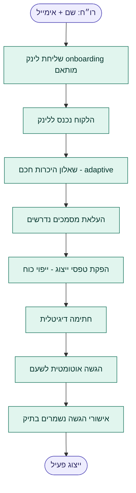

# ENGAGEMENT_TEMPLATES.md — קטלוג תבניות התקשרות

> **Status:** Draft for review — **no implementation yet.**
> **Owner:** גיא ישר (solo CPA).
> **Last updated:** 2026-06-13.
> **Companion docs:** [PRODUCT_VISION.md](PRODUCT_VISION.md) · [SPEC.md](SPEC.md)
> **Grounded in:** the existing 1301 engine — [form1301Fields.ts](src/features/annualReport/form1301Fields.ts), [1301_full_flow.md](docs/1301_full_flow.md), [1301_coverage_audit.md](1301_coverage_audit.md).

This catalog defines the **professional workflows** behind each service the firm offers. Each engagement is an instance of one of these templates. These definitions are the foundation for future screens, automations, and AI capabilities — once approved, screens are designed *to fit them*.

---

## A. Shared model

### A.1 Engagement = type + workflow + checklist + documents + communication + AI + automation

Every engagement carries: a **type**, an ordered **workflow** of stages, a **checklist**, the **documents** it needs, its slice of the **communication timeline**, assigned **AI agents**, and **automations** triggered by stage changes.

### A.2 Board status vocabulary (Work Center)

Each engagement stage maps onto a small, shared set of board statuses (the Monday-style flow):

`New (חדש) → In Progress (בעבודה) → Waiting for Client (ממתין ללקוח) → Waiting for Authority (ממתין לרשות) → Completed (הושלם)`

A stage is *where* the work is in its professional process; a status is *who the ball is on* right now. Both are tracked.

### A.3 AI agent roster (referenced by the templates)

| Agent | Job |
|---|---|
| **Client Interview Agent** (סוכן ראיון) | Runs the adaptive questionnaire; asks the minimum follow-ups. |
| **Document Collector** (גובה מסמכים) | Requests, chases, and tracks documents until complete. |
| **Document Classifier** (מסווג מסמכים) | OCR + classify uploads, extract fields, file to the right slot. |
| **Missing-Info Agent** (מידע חסר) | Maintains the open-items list; decides what to ask next. |
| **Workpaper Prep Agent** (ניירות עבודה) | Drafts reconciliations, annexes, and computations. |
| **Tax Review Agent** (ביקורת מס) | Reviews a draft for errors, missed credits, and risks. |

Every agent action is **logged into the task, the engagement, and the client timeline**, and is gated by an autonomy level (suggest / act-with-approval / autonomous).

---

## 1. Representation (ייצוג) — the flagship onboarding workflow

**Purpose** — Bring a new client to "actively represented before the tax authorities" with as little manual work as possible: from a name + email to a signed power of attorney filed with SHAAM, with confirmations stored in the file.

**Workflow stages**
1. Create request (רו״ח מזין שם + אימייל)
2. Invite client (personalized onboarding link sent)
3. Smart intro questionnaire (adaptive — §2 questionnaire engine)
4. Document collection (ID etc., driven by the checklist)
5. Generate representation forms (ייפוי כוח auto-filled)
6. Digital signature (client signs)
7. Submit to SHAAM (automatic)
8. Confirm & file (submission confirmations stored)

**Required documents** — Client ID + ספח; for a company: company registration + authorized-signatory IDs; existing accountant release (if switching); the generated ייפוי כוח itself.

**Checklist** — Client identity verified · representation scope chosen (מ״ה / מע״מ / ניכויים / בט״ל) · forms generated · signature captured · SHAAM submission succeeded · confirmation archived.

**Client interactions** — One onboarding link → questionnaire → uploads → e-signature. No back-and-forth email; everything posts to the timeline.

**Automation opportunities** — Send the onboarding link; reminders if the client stalls; auto-generate ייפוי כוח from profile; auto-submit to SHAAM via the gov connector; auto-store confirmations on success.

**AI opportunities** — Client Interview Agent runs the questionnaire; Document Classifier reads the uploaded ID and pre-fills identity; Missing-Info Agent chases anything outstanding.

**Deliverables** — Signed ייפוי כוח (PDF) · SHAAM filing confirmation · "active representation" status on the client.

---

## 2. Annual Tax Return — Form 1301 (דוח שנתי ליחיד)

**Purpose** — Produce and file an individual's annual return, collecting the maximum tax-relevant information with the minimum number of questions, and knowing precisely which 1301 fields are relevant, which data exists, and which documents are missing.

**Workflow stages**
1. Open (instantiate for the tax year; pre-fill from prior year + client card)
2. Smart 1301 questionnaire (Validation-First — confirms 17 facts from the card, asks only what changed)
3. Profile sync (Sync Confirmation writes answers back to the client card)
4. Document collection (checklist grouped by source)
5. Data processing (bookkeeping / annexes)
6. Workpapers & adjustments (התאמות מס)
7. Draft return
8. Client approval
9. File / transmit (שידור)
10. Assessment & archive (שומה + תיוק)

**Required documents** (auto-derived per profile — examples) — 106 per employer · 867 per bank/investment account · נספח א׳ (1320) + P&L for business · rental contract/receipts by track · 161/pension · donation §46 receipts · advance-payments report from SHAAM. *(The engine emits the exact list from the answered questionnaire.)*

**Checklist** — Questionnaire complete · profile synced · all source documents received · annexes built · adjustments computed · draft reviewed · client approved · transmitted · confirmation filed.

**Client interactions** — The adaptive questionnaire (5–10 min for an existing client thanks to Validation-First); document upload requests; final approval before filing.

**Automation opportunities** — Pre-fill from last year; per-source document requests + chasing; pull advance-payments and withholding data from SHAAM; auto-archive the filing confirmation.

**AI opportunities** — Interview Agent (questionnaire) · Document Collector + Classifier (106/867 extraction) · Workpaper Prep (adjustments, annexes) · Tax Review Agent (missed credits/points, risk flags).

**Deliverables** — Filed 1301 + annexes · tax computation · filing confirmation · updated client tax profile.

---

## 3. Capital Declaration (הצהרת הון)

**Purpose** — Produce a complete statement of the client's assets and liabilities on a given date (often on demand from the assessing officer), and, when a prior declaration exists, support the capital-comparison (השוואת הון) analysis.

**Workflow stages**
1. Receive demand (capture the required date + deadline)
2. Assets & liabilities questionnaire (drives the Client Workspace Assets & Liabilities section)
3. Collect supporting evidence
4. Build the declaration form
5. Capital comparison (if a prior declaration exists)
6. Draft
7. Client approval
8. File
9. Archive

**Required documents** — Bank balances at the date · real-estate ownership + values · vehicle ownership · investment portfolio statements · loan/mortgage balances · cash/receivables · gifts/inheritances received · prior declaration (for comparison).

**Checklist** — All asset classes captured · all liabilities captured · evidence attached per line · prior declaration loaded · comparison reconciles (or differences explained) · client approved · filed.

**Client interactions** — A structured assets/liabilities questionnaire; evidence uploads; explanation of unexplained capital differences.

**Automation opportunities** — Pre-fill from the Client Workspace Assets & Liabilities section; pull bank/investment balances via connectors; flag differences vs the prior declaration automatically.

**AI opportunities** — Interview Agent (assets/liabilities) · Document Classifier (statements → balances) · a comparison analyzer that drafts explanations for capital differences.

**Deliverables** — Capital declaration form · capital-comparison schedule · filing confirmation · refreshed Assets & Liabilities profile.

---

## 4. Bookkeeping (הנהלת חשבונות שוטפת) — recurring

**Purpose** — Maintain accurate, up-to-date books each period as the data backbone that feeds VAT, advances, payroll, and the annual return.

**Workflow stages (monthly cycle)**
1. Intake (collect receipts/invoices/statements)
2. Classify & record
3. Bank reconciliation
4. Period close
5. Periodic filings hand-off (VAT / advances)
6. Management report

**Required documents** — Sales invoices · purchase invoices/receipts · bank & credit-card statements · petty cash · prior-period closing balances.

**Checklist** — All documents in · all transactions classified · bank reconciled · exceptions resolved · month closed · figures handed to VAT/advances.

**Client interactions** — Ongoing document submission (portal / email / photo); queries on unclear transactions.

**Automation opportunities** — Two-way sync with the bookkeeping connector; monthly intake reminders; auto-create the VAT and advances engagements when the month closes.

**AI opportunities** — Document Classifier (auto-categorize receipts) · Reconciler (match transactions, flag anomalies) · Missing-Info Agent (chase unclear items).

**Deliverables** — Closed monthly books · trial balance · management report · clean data for downstream engagements.

---

## 5. Payroll (שכר) — recurring

**Purpose** — Run accurate monthly payroll per client and meet all reporting and payment obligations to the authorities.

**Workflow stages (monthly)**
1. Intake (hours, changes, new hires/leavers)
2. Compute payroll
3. Employer approval
4. Generate payslips
5. Report & pay authorities (ניכויים to מ״ה, בט"ל)
6. Distribute payslips
7. Year-end (106 / 126)

**Required documents** — New-employee 101 forms · attendance/hours · salary changes · termination details · pension/provident instructions.

**Checklist** — Inputs received · payroll computed · employer approved · payslips issued · 102 filed · payments made · payslips distributed.

**Client interactions** — Monthly inputs from the employer; approval of the run; employee 101 collection.

**Automation opportunities** — Sync with the payroll connector; auto-file 102 and payment instructions; auto-distribute payslips; deadline reminders.

**AI opportunities** — Payroll intake parsing · anomaly detection (unusual changes) · 101 classification/extraction.

**Deliverables** — Payslips · 102/126 reports · authority payments · annual 106 per employee.

---

## 6. VAT Reporting (דיווח מע"מ) — recurring

**Purpose** — Prepare and file each VAT period (monthly or bi-monthly) accurately and on time.

**Workflow stages**
1. Intake / pull from bookkeeping
2. Reconcile inputs vs outputs
3. Compute VAT
4. Approve
5. Submit to SHAAM
6. Pay
7. Archive

**Required documents** — Sales invoices · input-tax invoices · PCN874 data (detailed file) · bookkeeping period totals.

**Checklist** — Period data complete · inputs/outputs reconciled · VAT computed · approved · PCN874 generated · submitted · paid · confirmation filed.

**Client interactions** — Mostly automatic from bookkeeping; queries only on missing/unclear invoices.

**Automation opportunities** — Pull totals from the bookkeeping connector; generate PCN874; submit to SHAAM; deadline reminders; auto-archive confirmation.

**AI opportunities** — Invoice classification · input-tax eligibility checks · reconciliation/anomaly flags.

**Deliverables** — PCN874 file · VAT filing confirmation · payment record.

---

## 7. New Business Opening (פתיחת עסק)

**Purpose** — Set a new business up correctly from day one: choose the right structure and open all required files with the authorities.

**Workflow stages**
1. Characterization questionnaire (activity, expected turnover, employees, partners)
2. Structure recommendation (עוסק פטור / עוסק מורשה / חברה)
3. Open VAT file (מע"מ)
4. Open income-tax file (מ"ה)
5. Open withholding file (ניכויים — if an employer)
6. National Insurance registration (בט"ל)
7. Initial setup advice (bookkeeping method, advances, invoicing)
8. Complete

**Required documents** — Owner ID · business details · bank account · lease/address proof · partnership/company incorporation docs (if applicable).

**Checklist** — Structure decided · VAT file open · income-tax file open · withholding file open (if needed) · בט"ל registered · invoicing/bookkeeping set up · client briefed.

**Client interactions** — Characterization questionnaire; document upload; a setup briefing.

**Automation opportunities** — File-opening submissions via gov connectors; auto-generate registration forms; spin up the recurring Bookkeeping/VAT/Payroll engagements on completion.

**AI opportunities** — Structure-recommendation assistant (turnover/liability trade-offs) · form auto-fill · checklist generation tailored to the activity.

**Deliverables** — Confirmations of all opened files · a setup summary · the recurring engagements created and ready.

---

## Flagship flow — Representation & onboarding

> No implementation begins until these engagement models, workflows, and the architecture are reviewed and approved.
