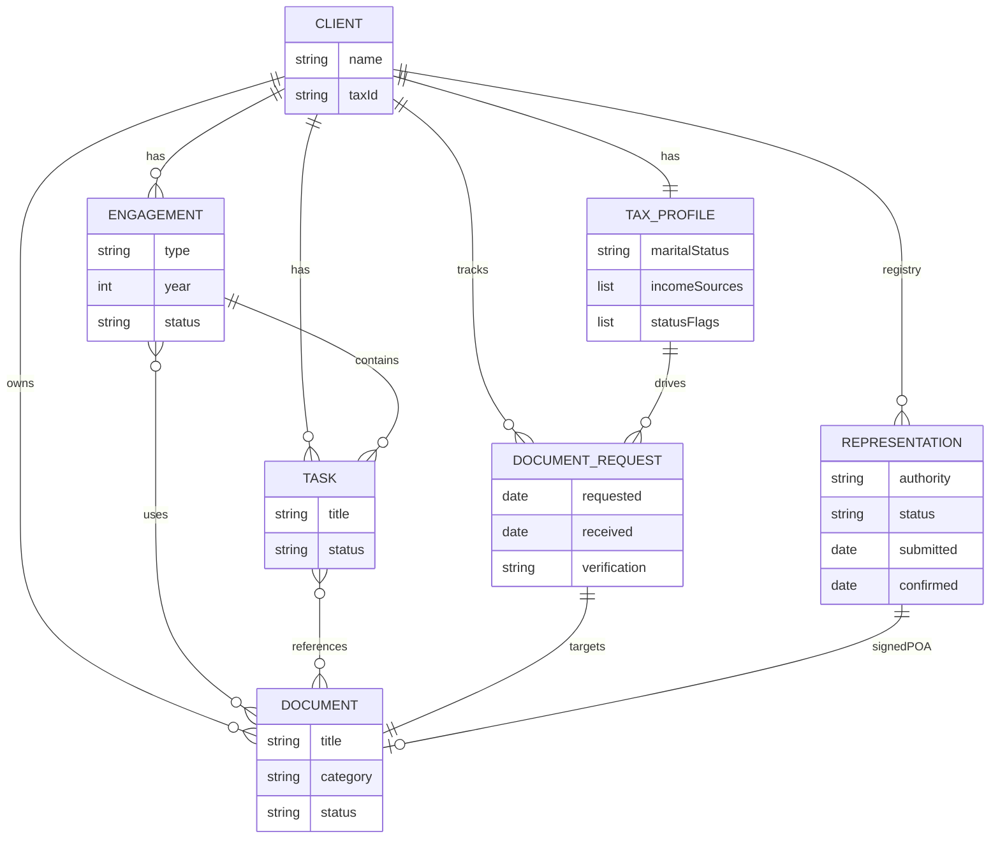

# MVP_DATA_MODEL.md — the operational core

> **Status:** Locked for MVP design — **no implementation yet.**
> **Owner:** גיא ישר (solo CPA).
> **Last updated:** 2026-06-13.
> **Companion docs:** [PRODUCT_VISION.md](PRODUCT_VISION.md) · [ENGAGEMENT_TEMPLATES.md](ENGAGEMENT_TEMPLATES.md)

This is the agreed v1 data model for the platform's operational core: seven concepts, their fields, their relationships, and the rules that connect them.

---

## 0. Core principle — ownership ≠ usage

- A **Document is owned by exactly one Client** and lives in that client's permanent repository forever.
- A Document is **used by** zero-or-more Engagements and Tasks through **links**, not ownership.
- Closing or deleting an engagement removes a *link*, never the document.
- The links are **first-class and bidirectional**: readable from either end ("where is this document used" / "what documents does this task need").

The same principle separates transient *work* from durable *state*: the Representation engagement is the workflow; the Representation Registry record is the permanent status it produces.

---

## 1. Entities

### 1.1 Client — the permanent anchor and document owner

| Field | Type | Notes |
|---|---|---|
| id | id | |
| name | text | |
| entityType | company \| individual | |
| taxId | text | ח.פ / ת.ז |
| email, phone | text | MVP contact |
| status | active \| prospect \| inactive | |

*Relationships:* 1 → many Engagement · 1 → many Document (**owns**) · 1 → many Task · 1 → 1 TaxProfile · 1 → many RepresentationRecord · 1 → many DocumentRequest.

### 1.2 Engagement — a unit of professional work for one client

| Field | Type | Notes |
|---|---|---|
| id | id | |
| clientId | → Client | belongs to one client |
| type | representation \| annual_return \| capital_declaration \| bookkeeping \| payroll \| vat \| new_business | |
| title | text | e.g. "דוח שנתי 2025" |
| year / period | number | |
| stage | text | current workflow stage |
| status | New \| In Progress \| Waiting for Client \| Waiting for Authority \| Completed | |
| ownerId, dueDate | | |
| answers[] | per-year data | **per-year amounts live here, not on the Tax Profile** |

*Relationships:* many → 1 Client · 1 → many Task · many ↔ many Document (via link).

### 1.3 Task — one actionable item; the unit on the Work Dashboard

| Field | Type | Notes |
|---|---|---|
| id | id | |
| title | text | |
| clientId | → Client | **always set** |
| engagementId | → Engagement | **optional** (standalone tasks allowed) |
| status | New \| In Progress \| Waiting for Client \| Waiting for Authority \| Completed | |
| ownerId, dueDate, notes | | |

*Relationships:* many → 1 Client · many → 1 Engagement (optional) · many ↔ many Document (via link).

### 1.4 Document — owned by the client, reusable everywhere

| Field | Type | Notes |
|---|---|---|
| id | id | |
| clientId | → Client | **OWNER — document-first** |
| title | text | |
| category | id \| form_106 \| form_867 \| contract \| certificate \| report \| poa \| capital_decl \| payroll \| vat \| other | |
| tags | text[] | free tags |
| year | number \| null | null = timeless (ID, lease) |
| status | requested \| received \| verified \| superseded | |
| source | client \| employer \| bank \| authority \| accountant | |
| fileRef | storage | null while `requested` |

*Relationships:* many → 1 Client (owner) · many ↔ many Engagement · many ↔ many Task · 0..1 DocumentRequest (targets it).

### 1.5 TaxProfile — the permanent tax-knowledge layer (1:1 with Client)

Permanent facts only. **Entities and structure are permanent; amounts and events are per-year** (and live on the Engagement).

Permanent attributes (MVP): marital status / spouse · children (count, years, special needs) · disability % · residency · qualifying settlement · income source *types* · employers[] · bank & investment accounts[] · properties[] · pension funds[] (+ self-deposits) · status flags (discharged soldier, academic degree, custodial single parent, family-company member, CFC, kibbutz, elects §14).

| Classification | Meaning |
|---|---|
| **Permanent across years** | Stored on the profile; persists (all of the above). |
| **Synced from questionnaire** | Structural changes (new employer/child/account, gained degree, started business) write back via Sync Confirmation. Amounts do **not** sync up. |
| **Drives document requests** | Each entity → a `DocumentRequest` (employer → 106; account → 867; rented property → lease; self-deposit fund → certificate; disability → medical cert; child → ID). |
| **Drives engagement logic** | Source-types + flags decide which 1301 fields are active/pruned, which annexes are required, and which engagements to suggest. |

*Relationships:* 1 → 1 Client · drives → many DocumentRequest.
*Grounded in the existing engine:* [form1301Fields.ts](src/features/annualReport/form1301Fields.ts), [1301_full_flow.md](docs/1301_full_flow.md).

### 1.6 RepresentationRecord — first-class status per authority

Up to 3 per client (one per authority). Durable status, separate from the Representation engagement that creates it.

| Field | Type | Notes |
|---|---|---|
| clientId | → Client | |
| authority | income_tax \| vat \| national_insurance | |
| status | none \| pending_signature \| submitted \| active \| expired \| revoked | |
| signedPoaDocumentId | → Document | the signed ייפוי כוח |
| submittedDate | date | |
| confirmationDocumentId | → Document | authority confirmation |
| confirmationReceivedDate | date | |
| history[] | list of `{date, event, note}` | full audit trail |

*Relationships:* many → 1 Client · references Documents (POA, confirmation) · created/updated by a Representation engagement.

### 1.7 DocumentRequest — the act of asking, with its lifecycle

Promoted from a mere status so reminder history and dates are explicit and auditable.

| Field | Type | Notes |
|---|---|---|
| clientId | → Client | |
| documentId | → Document | the slot it will fill (the `requested` document) |
| engagementId / taskId | → context | what it's needed for |
| requestedDate | date | |
| reminders[] | list of `{date, channel}` | full chase history |
| receivedDate | date \| null | |
| verificationStatus | pending \| verified \| rejected | |

**Lifecycle:** `requested` → `reminded` (each reminder appended) → `received` (client uploads → Document gets file, status `received`) → `verified` (Document → `verified`). The Document is the permanent artifact; the request is the one-time, auditable interaction.

---

## 2. Link tables (the bidirectional glue)

| Link | Connects | Meaning |
|---|---|---|
| `DocumentEngagementLink` | documentId ↔ engagementId | a document is used in an engagement |
| `DocumentTaskLink` | documentId ↔ taskId | a document is referenced by a task |

---

## 3. The model

---

## 4. User flows

1. **Upload once, reuse across years.** Client uploads ID in Representation 2023 → one client-owned `Document` + links to that engagement/task. In 2025 the Annual Return needs the ID → link the existing document. Same document, two engagements, two years. No duplication.
2. **From a document → "where used."** Open the ID → lists every linked engagement and task (reads both link tables).
3. **From a task → "related documents."** Open "Prepare annex 1320" → its linked documents open in one click.
4. **Work Dashboard → spot trouble → drill in.** Tasks grouped by status across clients; overdue + waiting flags; click a task → opens its requested document + engagement.
5. **Create engagement → repository auto-populates.** New "Annual Return 2025" → template generates tasks + `requested` documents (each backed by a `DocumentRequest`) → they appear in the repository (`requested`) and on the dashboard. As files arrive: `requested → received → verified`, visible everywhere they're linked.

---

## 5. MVP scoping decisions (approved 2026-06-13)

1. **Per-year amounts live on the Engagement, not the permanent Tax Profile.** Only structural facts are permanent.
2. **One Representation record per authority** (max 3). Sub-period / historical-firm representation nuance is **V2**.
3. **A Document is owned by one Client.** Cross-client shared documents are **V2**.

---

> No implementation begins until each MVP screen built on this model is reviewed and approved.
