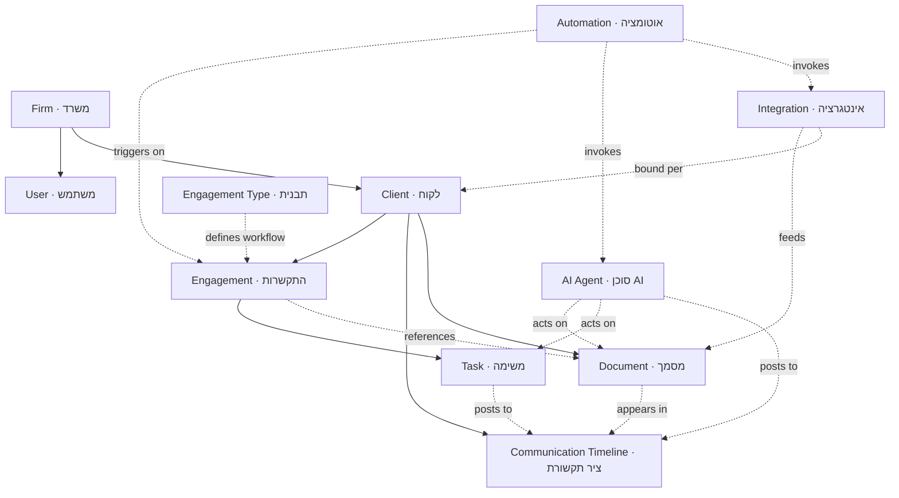

# PRODUCT_VISION.md — מערכת הפעלה למשרד רואי חשבון

> **Status:** Draft for review — **no implementation yet.**
> **Owner:** גיא ישר (solo CPA / רו"ח יחיד).
> **Last updated:** 2026-06-13.
> **Companion docs:** [SPEC.md](SPEC.md) (current app spec), [CLAUDE.md](CLAUDE.md) (working agreement).

---

## 0. What this document is

This defines the **long-term product vision**, the **architecture**, and — the heart of this revision — the **core concepts** of the platform and how they relate to one another.

Screens are designed *on top of* these concepts. We lock the concepts first, then design screens, then implement. Approval is required at each stage before the next begins.

---

## 1. Vision

This product is **not a CRM**. The CRM is only the first layer of an **AI-powered operating system for an accounting firm**.

The long-term goal is a platform that can:

- Manage clients and engagements
- Collect documents automatically
- Communicate with clients
- Run workflows and automations
- Ask clients questions automatically
- Track missing information
- Generate workpapers
- Assist in preparing financial statements
- Assist with tax returns
- Integrate with bookkeeping, payroll, and government services (e.g. SHAAM / שע"ם)
- Serve as the central operating system for the firm

**Evolution principle:** initially many functions connect to third-party systems (bookkeeping, payroll, SHAAM via browser automation). Over time, some external systems may be replaced by modules built directly into the platform — **without re-architecting**, because of the integration abstraction (§2.4).

---

## 2. Design principles

1. **Entity-first, not feature-first.** The platform is organized around durable domain objects (§4), not around today's features. Features come and go; the objects endure.
2. **Two lenses over the same data.** *Work Center* (the firm's view: cross-client, by status) and *Client Workspace* (one client: everything about them). Everything is reachable from one of these two.
3. **Process-driven.** Accounting work is a process, not a checklist. Engagements carry structured **workflows** (stages + checklist), while the Work Center runs a flexible, Monday-style board on top.
4. **Integration abstraction — capability, not vendor.** The app sees a *capability* ("bookkeeping source", "gov-service source"), never the specific vendor or mechanism. So an external connector can be swapped for a native module later and **nothing else changes**.
5. **Human-in-the-loop AI.** Every AI agent action is **logged and gated** by an autonomy level you control (suggest / act-with-approval / autonomous). Liability demands it.
6. **Solo-first, firm-ready.** Designed for one CPA today, with the structure (roles, departments, assignment) ready to activate for a team later — no major redesign.
7. **Preserve existing capabilities.** Nothing from today's app is dropped without a clear reason (§8 mapping).

---

## 3. Architecture layers

| Layer | Name | Contains |
|---|---|---|
| 0 | **Foundation** | Identity, firm/tenant, roles & permissions, audit log, notifications, storage |
| 1 | **Domain core** | The core concepts (§4): Client, Engagement, Task, Timeline, Document |
| 2 | **Intelligence & automation** | AI agents, the workflow/automation engine, missing-info tracking, document understanding (OCR) |
| 3 | **Integration fabric** | Connectors to bookkeeping / payroll / SHAAM / banks, behind stable internal capability interfaces |
| 4 | **Experience** | Work Center, Client Workspace, Engagement Workspace, Communications, Firm Dashboard, Client Portal |

The most important architectural decision lives in **Layer 3**: it is the literal mechanism for "external today, native tomorrow."

---

## 4. Core concepts — definitions

Foundational context: a **Firm (משרד)** is the top-level tenant; **Users (משתמשים)** are the people in it (today: just גיא; later: employees with roles such as accountant, bookkeeper, payroll manager). All concepts below live inside a Firm.

### 4.1 Client (לקוח)

- **Definition:** The entity the firm serves — a business or an individual. The long-lived "who." A client persists across many years and many jobs.
- **Contains:** Identity (name, ח.פ / ת.ז), type (company / individual / partnership), status, the professional profile (~50 fields: classifications, credit points, pension, assets), contacts, and bindings to external accounts.
- **Is the container for:** Engagements, one Communication Timeline, Documents, and Integration bindings.
- **Is NOT:** a single job or period. A specific year's work is an *Engagement*, not the Client.

### 4.2 Engagement (התקשרות)

- **Definition:** A defined unit of professional work for a client, usually scoped to a period or matter. **The central organizing object** of the platform.
- **Examples:** annual tax return, monthly/ongoing bookkeeping, a VAT period, a payroll month, capital declaration (הצהרת הון), representation (ייצוג), company reporting.
- **Contains:** a **type**, a period/scope, a **status / current stage**, a **workflow** (ordered stages), a **checklist**, its own subset of Documents, its own Tasks, its own slice of the Timeline, assigned Agent(s), and Automations.
- **Is NOT:** the firm-wide work list (that's the Work Center), and **not a single task** — it is the *bundle* and the *process*.
- **Engagement Type / Template (תבנית התקשרות):** a reusable definition of the stages + checklist for a service. **This is how new services scale** — adding a service = adding a template, not building a screen.

### 4.3 Task (משימה)

- **Definition:** An atomic, actionable item — one to-do. The unit that moves on the Work Center board between statuses.
- **Contains:** title, status, **"ball in court" (אצל מי הכדור: אצלי / לקוח / רשות / תקוע)**, owner, due date, category (מ"ה / מע"מ / ב"ל / ניכויים / ביקורת…), and links to its Engagement / Client / Timeline.
- **Is NOT:** a workflow. A Task is one step; the structured **workflow lives at the Engagement level**. A Task usually belongs to an Engagement (a step within it) but may be standalone (ad-hoc).

### 4.4 Communication Timeline (ציר תקשורת)

- **Definition:** The complete, chronological record of **every interaction** with a client. A *stream/ledger*, not a folder. This replaces managing clients through Gmail folders.
- **Contains entries of every type:** email conversations, attachments, documents sent for signature, signed documents, requests sent to the client, documents uploaded by the client, AI-generated follow-ups, internal notes, and communication tied to tasks/engagements.
- **Each entry has:** type, timestamp, author (human **or** agent), and links to the relevant Engagement / Task / Document.
- **Is NOT:** a separate email app. It is one unified per-client ledger, filterable per-engagement — the central history of the firm's relationship with the client.

### 4.5 Document (מסמך)

- **Definition:** Any file in the system — receipts, statements, forms, signed PDFs, generated workpapers.
- **Contains:** the file plus metadata: type, source, **status (requested / received / missing)**, OCR-extracted data, owner client, and links to Engagements and Timeline entries.
- **Is NOT:** the professional logic itself. A *workpaper's content* is professional work; the **Document** is the artifact/file it is captured as. Agents may *produce* documents and *consume* them.

### 4.6 Automation (אוטומציה)

- **Definition:** A defined, rule-based, repeatable process: **trigger + conditions + steps**, with optional human-approval gates. Deterministic and configurable.
- **Examples:** "on entering the *client approval* stage → send the draft for e-signature"; "every month → request VAT receipts"; "new client → run the onboarding workflow".
- **Contains:** trigger, conditions, ordered steps, approval gates, scope (firm / client / engagement), status.
- **Is NOT:** an AI Agent. An Automation is **fixed logic** (if-this-then-that). An Agent is an **adaptive AI worker**. An Automation may *invoke* an Agent or an Integration as one of its steps.

### 4.7 AI Agent (סוכן AI)

- **Definition:** A named, scoped **AI worker** with a defined job, permissions, and an **autonomy level** (suggest / act-with-approval / autonomous). Adaptive — handles fuzzy inputs, natural language, and documents.
- **Examples:** Document Collector (גובה מסמכים), Missing-Info Chaser (רודף מידע חסר), Bookkeeping Reconciler (מתאם הנה"ח), Return Drafter (מכין דוחות). Also surfaces as an **ambient assistant** available everywhere, aware of the current client/engagement.
- **Contains:** name, scope (which clients/engagements), capabilities, permissions, autonomy level, and a full **activity log**.
- **Is NOT:** unsupervised, and not "just a chatbot". Every action is logged and gated; it reports into the Work Center (approvals) and the Dashboard (daily digest).

### 4.8 Integration (אינטגרציה / חיבור)

- **Definition:** A connection to an external system (bookkeeping, payroll, SHAAM, banks), exposed to the rest of the platform through a **stable internal capability interface**. The mechanism — API, browser automation, or a future native module — is hidden.
- **Contains:** category, the capability it provides, mechanism, **health & last-sync**, credentials (stored securely), scope, and **per-client bindings**.
- **Is NOT:** vendor-specific in the app's eyes. The UI shows the *capability* ("bookkeeping: connected"), never the vendor — which is what makes swapping it for a native module invisible to everything else.

---

## 5. Relationship model

### 5.1 Diagram

### 5.2 Cardinalities

| Relationship | Cardinality |
|---|---|
| Firm → User | 1 → many |
| Firm → Client | 1 → many |
| Client → Engagement | 1 → many |
| Client → Communication Timeline | 1 → 1 (with many entries) |
| Client → Document | 1 → many |
| Engagement Type → Engagement | 1 → many (template instantiated) |
| Engagement → Task | 1 → many |
| Engagement ↔ Document | many ↔ many (references) |
| Engagement → Automation | 1 → many (plus firm-level automations) |
| Automation → Agent / Integration | invokes (many → many) |
| Agent → Document / Task / Timeline | acts on / posts to |
| Integration → Client | bound per-client |

### 5.3 In words

A **Client** is the hub. It holds many **Engagements**, exactly one **Communication Timeline**, and its **Documents**. Each **Engagement** is shaped by an **Engagement Type** (its workflow + checklist), breaks down into **Tasks**, and references the **Documents** it needs. **Tasks**, **Documents**, **Agents**, and inbound email all **post entries into the Timeline**, so the client's history is complete. **Automations** watch for triggers (often an Engagement stage change) and run steps that may **invoke Agents and Integrations**. **Agents** do adaptive work on Documents/Tasks and report back. **Integrations** feed data and documents in, and are bound per-client — but the rest of the platform only ever sees the *capability*, never the vendor.

---

## 6. How the concepts support the long-term vision

- **Client** — the stable anchor that accumulates years of history; the dataset future AI needs to run the relationship.
- **Engagement + Type** — the unit that lets the platform absorb *any* new service (payroll, capital declaration, financial statements) by adding a template, never a new app.
- **Task** — keeps day-to-day work flexible and visible on a Monday-style board, complementing rigid engagement workflows.
- **Communication Timeline** — turns scattered email into one relationship ledger; the substrate that makes "the platform runs the client relationship" possible.
- **Document** — a uniform artifact model so OCR, collection agents, e-signature, and workpaper generation all operate on one thing.
- **Automation** — encodes the firm's repeatable processes so the platform *does* work, not just *tracks* it.
- **AI Agent** — the adaptive workforce; the autonomy/approval model is what lets capability grow safely over time.
- **Integration** — the seam between "integrate now" and "build later"; the abstraction that protects every other layer from vendor churn.

---

## 7. Information architecture & navigation (summary)

Scalable right-hand RTL sidebar, grouped so new items slot into a group rather than lengthening a flat list:

- **Core:** בית (Dashboard) · מרכז העבודה (Work Center) · לקוחות (Clients) · תקשורת (Communications) · מסמכים (Documents)
- **Automation & AI:** אוטומציות ו-AI · אינטגרציות (Integrations)
- **Tools:** כלי מס (Tax tools — the existing calculator + guide) · דוחות ותובנות (Reports)
- **Utility:** הגדרות (Settings) · ambient AI assistant · global search / command palette

Role-based visibility hides what a given user shouldn't see; a client never sees this shell at all (they get the Portal).

---

## 8. Core screens (summary) & preservation map

| Screen | Purpose |
|---|---|
| **Firm Dashboard** | The pulse — what's at risk, where work is stuck, what's coming. Solo now; gains team-capacity later. |
| **Work Center** | Cross-client, Monday-style board; work moves between statuses; AI parks approvals as a column. |
| **Client Workspace** | One client: all engagements, documents, timeline, profile. |
| **Engagement Workspace** | One job: a stage pipeline, checklist, documents, workpapers, engagement-aware AI + automations. |
| **Communications Center** | The unified per-client timeline of every interaction type. |
| **Client Portal** | *(to be designed)* a separate, simplified client-facing surface: requests, missing docs, messages, uploads, status. |

**Existing capabilities — all preserved:** "על השולחן שלי" + ball-in-court → Work Center; tasks → board cards + engagement checklists; 50-field client → Client Workspace → פרטים; representation flow → an engagement type + the Portal; documents + OCR → Documents + collector agent; tax calculator + guide → Tax Tools; 1301 module → an "annual return" engagement template.

---

## 9. Personas (summary)

- **Firm owner** — Dashboard + Settings: capacity, risk, approvals, firm-level config.
- **Accountant (גיא today)** — Work Center + Client/Engagement Workspaces.
- **Bookkeeper** — Documents intake + reconciliation, monthly close.
- **Payroll manager** — a payroll-scoped Work Center, monthly runs + filing.
- **Client** — the separate, simplified **Client Portal** only.

---

## 10. Confirmed decisions (2026-06-13)

1. **Engagements** approved — a client contains multiple professional engagements; each has its own workflow, checklist, documents, communication, AI, and automation.
2. **Solo-first**, architecture firm-ready (employees / departments / roles later without a redesign).
3. **Client Portal** is a separate, simplified experience — clients see only requests, missing documents, messages, uploads, status updates, and items needing their attention.
4. **Communications is first-class** — a complete per-client timeline; the platform is the central place for the relationship history (not Gmail folders).
5. **Task management** is workflow-oriented (Monday-style stages + status movement), **not** a flat list; engagements additionally carry their own structured professional workflows.

---

## 11. Open items & design roadmap

- [x] **Engagement template catalog** → [ENGAGEMENT_TEMPLATES.md](ENGAGEMENT_TEMPLATES.md) (7 templates).
- [x] **AI agent roster** — §16 + catalog.
- [x] **MVP operational data model** → [MVP_DATA_MODEL.md](MVP_DATA_MODEL.md) (7 entities + link tables).
- [x] **Core accountant surfaces (MVP)** — Work Center, Client Workspace, Engagement Workspace → §17.
- [x] **Client Portal (MVP)** — designed.
- [x] **Implementation & migration plan** → [MIGRATION_PLAN.md](MIGRATION_PLAN.md) (6 phases, data-preserving).
- [ ] **Integration catalog** — first connectors (bookkeeping, payroll, SHAAM, banks) + capability interfaces (post-MVP).
- Future platform concepts acknowledged in §18 (Communications Hub, Agent Workspace).

---

## 12. Client knowledge repository (the Client Workspace structure)

The Client Workspace is the **single source of truth** for everything that may affect tax returns, capital declarations, tax planning, representation, and future AI workflows — not a traditional CRM record. It holds:

- **Tax Profile** — all tax-relevant facts accumulated over the years: family status, children, income sources, businesses, companies, foreign income, rental income, and anything gathered through questionnaires.
- **Assets & Liabilities** — real estate, apartments, vehicles, bank accounts, investments, loans, mortgages. (Feeds the Capital Declaration engagement.)
- **Pension & Savings** — pension funds, study funds (קרנות השתלמות), provident funds, insurance policies.
- **Documents** — all client-related files.
- **Representations** — income tax / VAT / National Insurance, with status and full history.
- **Open Missing Items** — a central list of missing documents, missing information, and unanswered questions.
- **Timeline** — the complete history: emails, documents, signatures, tasks, AI actions, filings, client interactions.
- **Knowledge / Insights** — accumulated flags that must be immediately visible: controlling shareholder, multiple rental properties, foreign income, foreign bank accounts, etc.

This structure persists across years; engagements read from and write to it.

## 13. Smart tax questionnaire (engine already exists)

The platform already contains a working adaptive questionnaire engine for Form 1301 ([form1301Fields.ts](src/features/annualReport/form1301Fields.ts), [1301_full_flow.md](docs/1301_full_flow.md)): 55 fields with conditional logic, a question→field index, **Validation-First** (pre-fills facts from the client card so an existing client answers in 5–10 min), and **Sync Confirmation** (writes answers back to the profile). It already determines which 1301 areas are relevant, which data exists, what's missing, and which documents to request. This engine is the foundation for onboarding and every tax engagement — we extend it, not replace it.

## 14. Onboarding & representation (flagship workflow)

Name + email → personalized onboarding link → smart questionnaire → document upload → auto-generated representation forms → digital signature → automatic submission to SHAAM → confirmations stored in the file. Full definition in [ENGAGEMENT_TEMPLATES.md §1](ENGAGEMENT_TEMPLATES.md). The goal is to remove as much manual work as possible from representation.

## 15. Task model & workflow statuses

Tasks are workflow-managed (Monday-style), **not** a flat list. Shared statuses:

`New (חדש) → In Progress (בעבודה) → Waiting for Client (ממתין ללקוח) → Waiting for Authority (ממתין לרשות) → Completed (הושלם)`

A task may be linked to a **Client, Engagement, Employee, and/or AI Agent**, and may contain **documents, notes, actions, and communications**. Documents linked to a task remain linked to the Client Workspace (one document, many references).

## 16. AI agent roster

| Agent | Job |
|---|---|
| Client Interview Agent | Runs the adaptive questionnaire; minimum follow-ups. |
| Document Collector | Requests, chases, tracks documents to completion. |
| Document Classifier | OCR + classify uploads, extract fields, file them. |
| Missing-Info Agent | Maintains the open-items list; decides what to ask next. |
| Workpaper Prep Agent | Drafts reconciliations, annexes, computations. |
| Tax Review Agent | Reviews drafts for errors, missed credits, and risks. |

Every agent action is logged into the relevant task, engagement, and client timeline, and is gated by an autonomy level (suggest / act-with-approval / autonomous).

## 17. Core accountant surfaces (MVP)

The three primary daily screens. All read and write the **same objects** (§4, [MVP_DATA_MODEL.md](MVP_DATA_MODEL.md)). AI agents and automations appear here only as **thin seams** in the MVP (their matured form is §18).

**Navigation** — a three-level drill-down: **Work Center** (all clients) → **Client Workspace** (one client) → **Engagement Workspace** (one engagement). A breadcrumb climbs back; a persistent left rail (Work Center · Clients · Documents · Settings) and a global client switcher allow sideways jumps. A task in the Work Center links straight to its engagement; a document links to every engagement/task that uses it.

### 17.1 Work Center — firm-wide work management

| Aspect | MVP |
|---|---|
| Top | Cross-client counts: אצלי · באיחור · ממתין ללקוח · ממתין לרשות. |
| Stages | Task **statuses** as columns (New → In Progress → Waiting for Client → Waiting for Authority → Completed). |
| Open / missing | "דורש תשומת לב" strip: overdue, waiting-on-client too long, AI pending approval. |
| Documents | 📎 count per task → peek/open linked documents. |
| Tasks | The unit here; each links to client + optional engagement. |
| Communications | Not in Work Center MVP. |
| AI | One line in the attention strip (e.g. "2 ממתינים לאישורך"). |
| Automations | Surfaced as the source of auto-created/updated cards. |
| Navigation | Click task → Engagement Workspace; click client → Client Workspace. |

### 17.2 Client Workspace — complete client file & knowledge base

| Aspect | MVP |
|---|---|
| Top | Identity + representation badges per authority + knowledge/insight flags (e.g. בעל שליטה, מרובה נדל״ן) + quick actions. |
| Stages | Each engagement's **status** in the engagements list (stages live inside the engagement). |
| Open / missing | Cross-engagement "פריטים פתוחים": every open `DocumentRequest` + unanswered question. |
| Documents | Repository snapshot → link to the full client Document Library; client-owned. |
| Tasks | Inside their engagements; "all open tasks" view reachable. |
| Communications | Recent timeline panel → full timeline. |
| AI | One client-scoped suggestion line. |
| Automations | Thin active-automations status line. |
| Navigation | Click engagement → Engagement Workspace; breadcrumb → Work Center. |

### 17.3 Engagement Workspace — the working area for one engagement

Same shell, per-type pipeline:

| Engagement type | MVP workflow stages |
|---|---|
| Annual Return 2025 | פתיחה · איסוף מסמכים · עיבוד וטיוטה · אישור לקוח · הגשה ותיוק |
| Capital Declaration | קבלת דרישה · שאלון נכסים · איסוף אסמכתאות · בניית טופס · אישור לקוח · הגשה |
| Representation | פרטים · מסמכים · הפקת ייפוי כוח · חתימה · הגשה לשע״ם · אישור ותיוק |
| Bookkeeping (monthly) | קליטת מסמכים · סיווג ורישום · התאמת בנק · סגירת חודש · דיווחים |

| Aspect | MVP |
|---|---|
| Top | Title + type + status/ball + owner + due + progress; breadcrumb to client. |
| Stages | Horizontal pipeline, current highlighted, click to advance. |
| Open / missing | "מה נדרש" (checklist + documents unified) with a "חסר בלבד" filter. |
| Documents | Listed in "מה נדרש," tagged with the form fields they feed; linked to client repository. |
| Tasks | The engagement's tasks — same objects shown on the Work Center board. |
| Communications | Thin recent-activity strip → full timeline. |
| AI | One line: silent OCR + any draft awaiting approval. |
| Automations | One line: active automations + stage-triggers. |
| Navigation | Breadcrumb → Client Workspace → Work Center. |

## 18. Future platform concepts (post-MVP — acknowledged for architecture)

Not MVP requirements. Recorded so future growth does **not** require a redesign — the MVP already leaves the seams in place.

### 18.1 Communications Hub (V2 → V3)

The matured form of §13/timeline: the central place for all client communication, reducing reliance on Gmail folders and disconnected systems. Will include: email conversations · client requests · signature workflows · client responses · notifications · AI-generated follow-ups.
*MVP seeds already present:* the per-client timeline, the `DocumentRequest` object (requests + reminders), and the existing signing flow. The Hub matures these into a full inbox; no model change required.

### 18.2 Agent Workspace (V2 → V3)

Operational visibility into AI agents as firm resources: which agents exist · what work is assigned · what each is currently doing · pending approvals · failures/exceptions · workload across agents.
*MVP seeds already present:* the agent roster (§16) and the "pending approval" lines on the Work Center and Engagement surfaces. The Agent Workspace is a management/observability layer over those same logged actions; no model change required.

> No implementation begins until each step is reviewed and approved. Build sequencing and data-preserving migration are defined in [MIGRATION_PLAN.md](MIGRATION_PLAN.md).
