# decision_tree.md — מפת עץ ההחלטות לטופס 1301

> **גרסה:** 0.3 · עדכון: 2026-05-15 — אחרי גלים א+ב
> **מקור הנתונים:**
> - שאלות בעץ: [src/features/annualReport/tree.ts](src/features/annualReport/tree.ts)
> - שדות הטופס: [src/features/annualReport/form1301Fields.ts](src/features/annualReport/form1301Fields.ts)
> - מנוע הכיסוי: [src/features/annualReport/coverage.ts](src/features/annualReport/coverage.ts)

---

## 1. תרשים זרימה — לאחר גלים א+ב

המקרא:
- 🟢 **מעוין ירוק** = החלטה שמובילה לאיסוף נתונים (פעיל).
- 🔵 **מלבן כחול** = איסוף נתונים בפועל בשאלון.
- 🔴 **מסגרת אדומה מקווקווה** = ענף שנפסל ע"י תשובת המשתמש (לא נשאל).
- 🟡 **כתום** = שדה ב-1301 שעדיין לא קיבל קישור (גל ג').

```mermaid
flowchart TD
    START([התחלה]):::terminal --> A1[פרטי זיהוי בסיסיים]:::data
    A1 --> A2{מצב משפחתי?}:::decision

    A2 -->|נשוי| SP1{בן זוג רשום — מי?}:::decision
    A2 -->|רווק/גרוש/אלמן/פרוד| C0[/דילוג על ענף בן/בת זוג/]:::pruned

    SP1 --> SP2{האם לבן זוג הכנסות?}:::decision
    SP2 -->|כן| SP3{האם 106 שלו/ה?}:::decision
    SP3 --> SP4{האם עסק לבן זוג?}:::decision
    SP4 --> SP5{זכאות לחישוב נפרד?}:::decision
    SP5 --> C1
    SP2 -->|לא| C1

    C0 --> C1[מספר ילדים]:::data
    C1 -->|>0| C2{ילדים — נתונים זמינים?}:::decision
    C2 --> C3{ילד עם צרכים מיוחדים?}:::decision
    C1 -->|=0| RES1{תושבות?}:::decision
    C3 --> RES1

    RES1 -->|תושב ותיק| QS{ישוב מזכה?}:::decision
    RES1 -->|עולה/חוזר| RES2{בוחר סעיף 14?}:::decision
    RES2 --> QS

    QS --> DIS{אחוז נכות מוכר?}:::decision
    DIS -->|כן| DIS2{באיזה אחוז?}:::decision
    DIS2 --> INC
    DIS -->|לא| INC

    INC[מקורות הכנסה — multi-select]:::data

    INC -->|שכר| S1[מספר מעבידים]:::data
    INC -->|עסק| B1{עוסק פטור/מורשה/חברה?}:::decision
    INC -->|שכ״ד| R1{מסלול שכ״ד?}:::decision
    INC -->|הון| H1{יש ני״ע?}:::decision
    INC -->|דיבידנד| D1{בעל מניות מהותי?}:::decision
    INC -->|חו״ל| F1[ארצות]:::data
    INC -->|אחר| O1{הגרלה/תמלוגים/פרס?}:::decision

    S1 --> S2{מענק פרישה?}:::decision

    B1 --> B2{רמת מחזור?}:::decision
    B2 --> B3{ניכוי במקור מלקוחות?}:::decision
    B3 --> B4{קרן השתלמות עצמאי?}:::decision

    R1 --> R2[סכום שכ״ד שנתי]:::data

    H1 -->|כן| H1B{ניכוי במקור מבית השקעות?}:::decision
    H1B --> H2{קריפטו?}:::decision
    H1 -->|לא| H2
    H2 --> H3{מכירת מקרקעין?}:::decision

    F1 --> F2[סוגי הכנסה חו״ל]:::data
    F2 --> F3{שולם מס זר?}:::decision

    %% התכנסות לענפי ריבית/פנסיה/אחר
    S2 --> INT{ריבית מבנק?}:::decision
    B4 --> INT
    R2 --> INT
    H3 --> INT
    D1 --> INT
    F3 --> INT
    O1 --> INT

    INT -->|כן| INT2{ניכוי במקור מהריבית?}:::decision
    INT --> PEN{פנסיה שוטפת?}:::decision
    INT2 --> PEN

    PEN --> OTH{הכנסות אחרות?}:::decision

    OTH --> DON[תרומות]:::data
    DON --> LIF[ביטוח חיים]:::data
    LIF --> PNS[פנסיה עצמאית]:::data
    PNS --> SOL{חייל משוחרר?}:::decision
    SOL --> ACA{תואר אקדמי?}:::decision

    ACA --> ADV{שילם מקדמות מ״ה?}:::decision
    ADV --> WHS[ניכוי במקור — מאיזה מקורות?]:::data
    WHS --> LOS{הפסדים מועברים?}:::decision
    LOS --> WD{הצהרת הון נדרשת?}:::decision
    WD --> SIG{אישור הצהרה לחתימה}:::decision
    SIG --> END([סיום — Checklist + מיפוי]):::terminal

    classDef decision fill:#dcfce7,stroke:#16a34a,color:#14532d,stroke-width:2px
    classDef data fill:#dbeafe,stroke:#2563eb,color:#1e3a8a,stroke-width:2px
    classDef pruned fill:#fee2e2,stroke:#dc2626,color:#991b1b,stroke-width:2px,stroke-dasharray:4
    classDef gap fill:#fef3c7,stroke:#f59e0b,color:#92400e,stroke-width:2px,stroke-dasharray:6
    classDef terminal fill:#f3f4f6,stroke:#6b7280,color:#374151
```



---

## 2. Coverage Matrix — מה כוסה בגלים א+ב

מ-44 שדות מוגדרים בסכמה (`form1301Fields.ts`):
- **6 always required** (פרטי זיהוי + חתימה)
- **38 conditional** (חיים רק לפי פרופיל)

| חלק בטופס | שדות | מצב |
|---|---|---|
| **1 — פרטים אישיים** | 001 (ת.ז), 002 (שם), 003 (תאריך לידה), 004 (כתובת), 113 (מצב משפחתי), D-pct (נכות) | ✅ |
| **2 — בני בית** | S-id (ת.ז בן זוג), S-role (בן זוג רשום), S-calc (חישוב נפרד/מאוחד), C-list (ילדים), C-special (ילד מיוחד) | ✅ |
| **3 — הכנסות מעבודה** | 158 (שכר ברוטו), 042 (ניכוי במקור משכר), 170 (מספר 106), 037-sev (מענק פרישה), S-spouse-salary | ✅ |
| **4 — הכנסות מעסק** | 150 (הכנסה מעסק), 6111-req (חובת 6111), B-client-wh (ניכוי מלקוחות) | ✅ |
| **5 — הכנסות פאסיביות** | 077/078/080 (שכ"ד 3 מסלולים), 126 (ריבית), 043 (ניכוי מריבית), P-pension (פנסיה) | ✅ |
| **6 — רווחי הון** | 142 (ני"ע), 253 (ניכוי במקור הון), 054 (מקרקעין), C-crypto (קריפטו), 036 (דיבידנד) | ✅ |
| **7 — הכנסות חו"ל** | 249 (הכנסות חו"ל), F-tax-credit (זיכוי מס זר) | ✅ |
| **8 — ניכויים** | 037 (תרומות), 045 (ביטוח חיים), 086 (פנסיה עצמאית), K-hashtalmut (קרן השתלמות), S14 (סעיף 14) | ✅ |
| **9 — זיכויים נוספים** | CR-soldier (חייל משוחרר), CR-academic (תואר אקדמי) | ✅ |
| **10 — מיסים ששולמו** | **040 (מקדמות מ"ה)**, WH-summary (סיכום ניכוי במקור) | ✅ |
| **11 — נסיבות מיוחדות** | L-losses (הפסדים מועברים), W-decl (הצהרת הון) | ✅ |
| **12 — חתימה** | SIG (הצהרה וחתימה) | ✅ |

**סטטוס:** 44/44 שדות עיקריים מוגדרים בסכמה, **100%** כל אחד עם `modelPath` ו-`sourceQuestionIds`.

> **מה עדיין שייך לגל ג' (מורכבות אופציונלית):**
> - פירוט עסק-לכל-עסק (אם נישום מנהל כמה עסקים נפרדים)
> - חישוב פריסה מענק פרישה (טופס 134)
> - תוספות ספציפיות לחברה משפחתית / שותפות
> - מיסוי קיבוץ / מושב שיתופי
> - חישובי הצמדה (פטור עד 13.10.96 / סיכון לשון)

---

## 3. דוגמה: רשימת סטטוס חי לתרחיש

תרחיש: **שכיר/ה נשוי/ה לבן זוג ללא הכנסה, שני ילדים, מתגורר תל-אביב (לא ישוב מזכה), שכר ממעביד אחד + תרומה 5,000 ₪ + תיאום מס.**

```
═══ סקירת מצב ═══════════════════════════════════════════
✅ פרטי זיהוי
✅ מצב משפחתי: נשוי
✅ בן זוג רשום: הנישום (בן/בת זוג ללא חובת הגשה)
✅ ילדים: 2 (יש להכין שנת לידה לכל אחד)
✅ תושבות: תושב ותיק (לא ישוב מזכה)
✅ נכות: אין
✅ הכנסות: רק שכר (1 מעביד)
✅ מענק פרישה: לא
❌ עסק / שכ"ד / הון / דיבידנד / חו"ל / אחר (נפסלו)
✅ ריבית: לא
✅ פנסיה שוטפת: לא
✅ הכנסות אחרות: לא
✅ תרומות: 5,000 ₪
✅ ביטוח חיים: לא דווח
✅ פנסיה עצמאית: לא דווח
✅ חייל משוחרר / תואר: לא
✅ מקדמות מ"ה: לא
✅ ניכוי במקור: רק משכר (042)
✅ הפסדים מועברים: לא
✅ הצהרת הון: לא נדרשה
✅ הצהרת חתימה: אושרה

═══ Checklist מסמכים נדרשים ═════════════════════════════
☐ תעודת זהות + ספח
☐ תעודת זהות בן/בת זוג
☐ טופס 106
☐ אישור תרומה (סעיף 46) — ל-5,000 ₪
☐ הצהרה וחתימה

═══ נספחים נדרשים ═══════════════════════════════════════
(אין — דוח רגיל מספיק)

═══ שדות 1301 שיתמלאו ═══════════════════════════════════
001 — ת.ז                          [מהלקוח]
002 — שם                            [מהלקוח]
003 — תאריך לידה                    [מהלקוח]
004 — כתובת                         [מהלקוח]
113 — מצב משפחתי = נשוי              [מהשאלון]
S-id — ת.ז בן/בת זוג                [מהלקוח]
S-role — בן זוג רשום = הנישום       [מהשאלון]
C-list — פירוט ילדים                [נדרש בשלב איסוף]
158 — שכר ברוטו                     [מ-106]
042 — ניכוי במקור משכר              [מ-106]
170 — מספר 106 = 1                  [מהשאלון]
037 — תרומות = 5,000                [מהשאלון]
SIG — חתימה                         [בסוף התהליך]

כיסוי: 13/13 שדות חיים = 100% ✅
```

---

## 4. Architecture — איך הקישור עובד

```
   QUESTION TREE                FORM 1301 SCHEMA              MODEL
   (tree.ts)                    (form1301Fields.ts)           (TaxpayerModel)
   ─────────────                ──────────────────             ───────────────
   ┌─────────────┐              ┌────────────────────┐         ┌──────────────┐
   │ QuestionNode│              │ Form1301FieldDef   │         │ TaxpayerModel│
   │  - id       │              │  - fieldNumber     │         │   identity   │
   │  - apply()  │──────────────│  - modelPath       │────────▶│   spouse     │
   │  - next()   │              │  - sourceQ_Ids ────┼─────────│   income     │
   │  - target_  │              │  - requiredDocs    │         │   taxPaid    │
   │    Codes    │              │  - conditionalOn() │         │   deductions │
   └─────────────┘              └────────────────────┘         └──────────────┘
        │                                  │                          │
        │                                  ▼                          │
        │                       computeCoverage(model)                │
        │                       ─ עבור כל field:                      │
        │                         ─ applicable? (conditionalOn)       │
        │                         ─ נענות sourceQuestionIds?          │
        │                       ▶ Coverage Report                     │
        │                                                             │
        ▼                                                             ▼
   answerAndAdvance()                                          buildDocumentChecklist()
   ─ apply to model                                            ─ עובר על fields חיים
   ─ next question                                             ─ מאחד דרישות מסמכים
```

---

## 5. עדיפויות לגל ג' (העתיד)

לפי עדיפות לדפוסי לקוחות:
1. **שאלות per-row** — פירוט ילד-לכל-ילד, פירוט עסק-לכל-עסק. דורש UI מסוג composite list.
2. **שאלות quantitative** — סכומים מדויקים שלא נדרשים ב-triage (יוזנו בשלב איסוף הנתונים).
3. **קצוות מורכבים** — חברה משפחתית, קיבוץ, פריסת מענקים, תושב חוזר ותיק.

---

## 6. קישור Mermaid Live

הקישור נוצר אוטומטית ע"י [scripts/gen-mermaid-link.mjs](scripts/gen-mermaid-link.mjs).
לעדכון אחרי שינוי בתרשים: `node scripts/gen-mermaid-link.mjs`.
