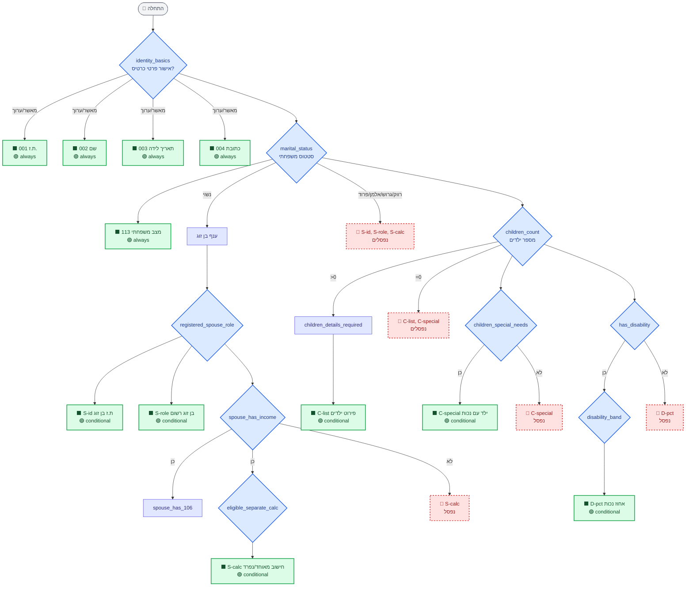
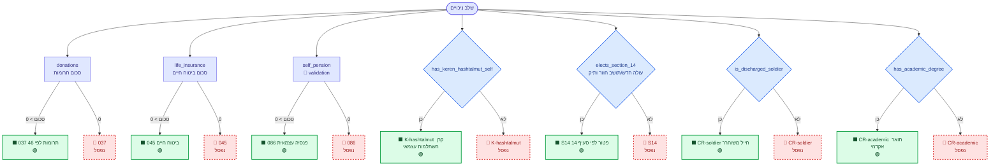

# מפת תהליך 1301 — כל 55 השדות, ההפעלה והנטרול

> **גרסה:** 2.0 — Wave ה' (2026-05-17). הוסיף 11 שדות + 11 שאלות + Validation-First מורחב + Sync Confirmation.
> **למה זה:** קישור 1-ל-1 בין כל שאלה בשאלון לבין השדות שהיא מפעילה (🟢) או מנטרלת (🔴) ב-1301.
> **מקורות אמת:** [tree.ts](../src/features/annualReport/tree.ts) (שאלון), [form1301Fields.ts](../src/features/annualReport/form1301Fields.ts) (55 שדות עם conditionalOn).
> **הצביעה ב-UI:** מסך 📋 פלט ומיפוי → טאב "🗺 מיפוי 1301" — כל שדה מוצג עם 🟢/🔴/🟡 לפי הסטטוס שלו עבור הלקוח הספציפי.

---

## מקרא

| סימן | משמעות |
|---|---|
| 🟢 | שדה **active** — רלוונטי לפרופיל. ייכנס לטופס 1301. |
| 🔴 | שדה **pruned** — נפסל אוטומטית ע"י תשובות השאלון (לא רלוונטי). |
| 🟡 | שדה **pending** — השאלון עוד לא הגיע לשאלות שמכריעות לגביו. |
| 🔵 | שאלה בשאלון (מעוין) או נקודת איסוף (מלבן). |
| ⬛ | שדה פיזי בטופס 1301. |

---

## תרשים A — פרופיל הנישום (פרטים אישיים, משפחה, ילדים, תושבות, נכות)

מכסה שדות: **001, 002, 003, 004, 113, D-pct, S-id, S-role, S-calc, C-list, C-special** (11 שדות).



---

## תרשים B — ענפי הכנסה (שכר, עסק, שכ"ד, הון, דיבידנד, ריבית, פנסיה, חו"ל)

מכסה שדות: **158, 042, 170, 037-sev, S-spouse-salary, 150, 6111-req, B-client-wh, 077, 078, 080, 126, 043, P-pension, 142, 253, 054, C-crypto, 036, 249, F-tax-credit** (21 שדות).

```mermaid
flowchart TD
    START([income_sources<br/>multi-select]):::decision

    %% ענף שכר
    START -->|שכר| Q_EMP[salary_employer_count<br/>📇 validation]:::data
    Q_EMP --> F158[⬛ 158 שכר ברוטו<br/>🟢]:::active
    Q_EMP --> F042[⬛ 042 ניכוי משכר<br/>🟢]:::active
    Q_EMP --> F170[⬛ 170 מספר 106<br/>🟢]:::active
    Q_EMP --> Q_SEV{received_severance}:::decision
    Q_SEV -->|כן| F037S[⬛ 037-sev מענק פרישה<br/>🟢]:::active
    Q_SEV -->|לא| P037S[🔴 037-sev<br/>נפסל]:::pruned

    Q_EMP -.אם נשוי + הכנסה לבן זוג + 106.-> FS_SAL[⬛ S-spouse-salary<br/>🟢]:::active

    %% ענף עסק
    START -->|עסק| Q_BK{business_kind}:::decision
    Q_BK --> Q_BREV{biz_revenue_band}:::decision
    Q_BREV -->|under_300k| P6111[🔴 6111-req<br/>נפסל]:::pruned
    Q_BREV -->|300k_plus| F6111[⬛ 6111-req חובת 6111<br/>🟢]:::active
    Q_BREV --> F150[⬛ 150 הכנסה מעסק<br/>🟢]:::active

    Q_BK --> Q_BCWH{biz_has_client_withholding}:::decision
    Q_BCWH -->|כן| FBCWH[⬛ B-client-wh ניכוי מלקוחות<br/>🟢]:::active
    Q_BCWH -->|לא| PBCWH[🔴 B-client-wh<br/>נפסל]:::pruned

    %% ענף שכ"ד
    START -->|שכ\"ד| Q_RT{rental_track}:::decision
    Q_RT -->|exempt| F077[⬛ 077 שכ\"ד פטור<br/>🟢]:::active
    Q_RT -->|exempt| P078_080[🔴 078, 080<br/>נפסלים]:::pruned
    Q_RT -->|flat10| F078[⬛ 078 שכ\"ד 10%<br/>🟢]:::active
    Q_RT -->|flat10| P077_080[🔴 077, 080<br/>נפסלים]:::pruned
    Q_RT -->|regular| F080[⬛ 080 שכ\"ד מסלול שולי<br/>🟢]:::active
    Q_RT -->|regular| P077_078[🔴 077, 078<br/>נפסלים]:::pruned

    %% ענף הון
    START -->|הון| Q_SEC{capital_has_securities<br/>📇 validation}:::decision
    Q_SEC -->|כן| F142[⬛ 142 רווחי הון מני\"ע<br/>🟢]:::active
    Q_SEC -->|כן| Q_SECWH{capital_securities_withholding}:::decision
    Q_SECWH -->|כן| F253[⬛ 253 ניכוי מרווחי הון<br/>🟢]:::active
    Q_SECWH -->|לא| P253[🔴 253<br/>נפסל]:::pruned
    Q_SEC -->|לא| P142[🔴 142, 253<br/>נפסלים]:::pruned

    Q_SEC --> Q_CRYP{capital_has_crypto}:::decision
    Q_CRYP -->|כן| FCRYP[⬛ C-crypto רווחי קריפטו<br/>🟢]:::active
    Q_CRYP -->|לא| PCRYP[🔴 C-crypto<br/>נפסל]:::pruned

    Q_CRYP --> Q_RE{capital_has_real_estate}:::decision
    Q_RE -->|כן| F054[⬛ 054 רווחי מקרקעין<br/>🟢]:::active
    Q_RE -->|לא| P054[🔴 054<br/>נפסל]:::pruned

    %% ענף דיבידנד
    START -->|דיבידנד| Q_DIV{dividend_controlling}:::decision
    Q_DIV --> F036[⬛ 036 דיבידנד<br/>🟢]:::active

    %% ענף ריבית
    START -->|ריבית| Q_INT{has_interest_income<br/>📇 validation}:::decision
    Q_INT -->|כן| F126[⬛ 126 ריבית<br/>🟢]:::active
    Q_INT -->|כן| Q_INTWH{interest_has_withholding}:::decision
    Q_INTWH -->|כן| F043[⬛ 043 ניכוי מריבית<br/>🟢]:::active
    Q_INTWH -->|לא| P043[🔴 043<br/>נפסל]:::pruned
    Q_INT -->|לא| P126[🔴 126, 043<br/>נפסלים]:::pruned

    %% ענף פנסיה שוטפת
    START -->|פנסיה| Q_PEN{has_pension_income}:::decision
    Q_PEN -->|כן| FPEN[⬛ P-pension קצבה<br/>🟢]:::active
    Q_PEN -->|לא| PPEN[🔴 P-pension<br/>נפסל]:::pruned

    %% ענף חו"ל
    START -->|חו\"ל| Q_FCNT[foreign_countries]:::data
    Q_FCNT --> Q_FKIND[foreign_income_kinds]:::data
    Q_FKIND --> F249[⬛ 249 הכנסות חו\"ל<br/>🟢]:::active
    Q_FKIND --> Q_FTAX{foreign_paid_tax_abroad}:::decision
    Q_FTAX -->|כן| FFCRED[⬛ F-tax-credit זיכוי מס זר<br/>🟢]:::active
    Q_FTAX -->|לא| PFCRED[🔴 F-tax-credit<br/>נפסל]:::pruned

    classDef decision fill:#dbeafe,stroke:#2563eb,color:#1e3a8a,stroke-width:2px
    classDef data fill:#e0e7ff,stroke:#4f46e5,color:#312e81,stroke-width:1px
    classDef active fill:#dcfce7,stroke:#16a34a,color:#14532d,stroke-width:2px
    classDef pruned fill:#fee2e2,stroke:#dc2626,color:#991b1b,stroke-width:2px,stroke-dasharray:4
```

---

## תרשים C — ניכויים וזיכויים

מכסה שדות: **037, 045, 086, K-hashtalmut, S14, CR-soldier, CR-academic** (7 שדות).



---

## תרשים D — מיסים ששולמו, נסיבות מיוחדות, חתימה

מכסה שדות: **040, WH-summary, L-losses, W-decl, SIG** (5 שדות).

```mermaid
flowchart TD
    START([שלב סיום]):::data

    START --> Q_ADV{paid_advance_payments<br/>מקדמות מ\"ה במהלך השנה?}:::decision
    Q_ADV -->|כן| F040[⬛ 040 מקדמות מ\"ה<br/>🟢]:::active
    Q_ADV -->|לא| P040[🔴 040<br/>נפסל]:::pruned

    START --> Q_WH[had_withholding_at_source<br/>מקורות עם ניכוי]:::data
    Q_WH -->|רשימה > 0| FWH[⬛ WH-summary סך ניכוי במקור<br/>🟢]:::active
    Q_WH -->|רשימה ריקה| PWH[🔴 WH-summary<br/>נפסל]:::pruned

    START --> Q_LOS{carried_losses<br/>הפסדים מועברים?}:::decision
    Q_LOS -->|כן| FLOS[⬛ L-losses הפסדים מועברים<br/>🟢]:::active
    Q_LOS -->|לא| PLOS[🔴 L-losses<br/>נפסל]:::pruned

    START --> Q_WDC{wealth_declaration_required<br/>נדרשה הצהרת הון?}:::decision
    Q_WDC -->|כן| FWDC[⬛ W-decl הצהרת הון<br/>🟢]:::active
    Q_WDC -->|לא| PWDC[🔴 W-decl<br/>נפסל]:::pruned

    START --> Q_SIG[final_declaration<br/>אישור הצהרה וחתימה]:::data
    Q_SIG --> FSIG[⬛ SIG הצהרה וחתימה<br/>🟢 always]:::active
    FSIG --> END([🏁 סיום תהליך]):::terminal

    classDef decision fill:#dbeafe,stroke:#2563eb,color:#1e3a8a,stroke-width:2px
    classDef data fill:#e0e7ff,stroke:#4f46e5,color:#312e81,stroke-width:1px
    classDef active fill:#dcfce7,stroke:#16a34a,color:#14532d,stroke-width:2px
    classDef pruned fill:#fee2e2,stroke:#dc2626,color:#991b1b,stroke-width:2px,stroke-dasharray:4
    classDef terminal fill:#f3f4f6,stroke:#6b7280,color:#374151
```

---

## טבלת Cross-Reference — מתי כל שדה ירוק (🟢) ומתי אדום (🔴)

הטבלה ממפה את **44 השדות** לתנאי ההפעלה והנטרול שלהם. השאלות לפי `sourceQuestionIds` מ-[form1301Fields.ts](../src/features/annualReport/form1301Fields.ts).

### חלק 1 — פרטים אישיים

| שדה | תיאור | 🟢 מופעל כש... | 🔴 נפסל כש... |
|---|---|---|---|
| 001 | ת.ז. הנישום | תמיד (always) | (לא נפסל) |
| 002 | שם פרטי + משפחה | תמיד (always) | (לא נפסל) |
| 003 | תאריך לידה | תמיד (always) | (לא נפסל) |
| 004 | כתובת + עיר | תמיד (always) | (לא נפסל) |
| 113 | מצב משפחתי | תמיד (always) | (לא נפסל) |
| D-pct | אחוז נכות | `has_disability` = כן | `has_disability` = לא |

### חלק 2 — בני בית

| שדה | תיאור | 🟢 מופעל כש... | 🔴 נפסל כש... |
|---|---|---|---|
| S-id | ת.ז בן/בת זוג | `marital_status` = נשוי | `marital_status` ≠ נשוי |
| S-role | בן הזוג הרשום | `marital_status` = נשוי | `marital_status` ≠ נשוי |
| S-calc | חישוב מאוחד/נפרד | נשוי + `spouse_has_income` = כן | אחד מהם לא |
| C-list | פירוט ילדים | `children_count` > 0 | `children_count` = 0 |
| C-special | ילד עם נכות | `children_special_needs` = כן | אחרת |

### חלק 3 — הכנסות מעבודה

| שדה | תיאור | 🟢 מופעל כש... | 🔴 נפסל כש... |
|---|---|---|---|
| 158 | שכר ברוטו | `income_sources` ⊇ {שכר} | שכר לא נבחר |
| 042 | מס שנוכה משכר | `income_sources` ⊇ {שכר} | שכר לא נבחר |
| 170 | מספר 106 שצורפו | `income_sources` ⊇ {שכר} | שכר לא נבחר |
| 037-sev | מענק פרישה | `received_severance` = כן | אחרת |
| S-spouse-salary | שכר בן/בת הזוג | נשוי + בן/ת זוג עם הכנסה + יש 106 | אחד מהם לא |

### חלק 4 — הכנסות מעסק

| שדה | תיאור | 🟢 מופעל כש... | 🔴 נפסל כש... |
|---|---|---|---|
| 150 | הכנסה מעסק — הנישום | `income_sources` ⊇ {עסק} | עסק לא נבחר |
| 6111-req | חובת 6111 (מחזור 300K+) | `biz_revenue_band` = `300k_plus` | אחרת |
| B-client-wh | ניכוי מלקוחות (857) | `biz_has_client_withholding` = כן | אחרת |

### חלק 5 — הכנסות פאסיביות

| שדה | תיאור | 🟢 מופעל כש... | 🔴 נפסל כש... |
|---|---|---|---|
| 077 | שכ"ד מסלול פטור | `rental_track` = `exempt` | מסלול אחר / אין שכ"ד |
| 078 | שכ"ד 10% | `rental_track` = `flat10` | מסלול אחר / אין שכ"ד |
| 080 | שכ"ד שולי | `rental_track` = `regular` | מסלול אחר / אין שכ"ד |
| 126 | ריבית | `has_interest_income` = כן | אחרת |
| 043 | ניכוי מריבית | `interest_has_withholding` = כן | אחרת |
| P-pension | קצבה | `has_pension_income` = כן | אחרת |

### חלק 6 — רווחי הון ודיבידנד

| שדה | תיאור | 🟢 מופעל כש... | 🔴 נפסל כש... |
|---|---|---|---|
| 142 | רווחי הון מני"ע | `capital_has_securities` = כן | אחרת |
| 253 | ניכוי מרווחי הון | `capital_securities_withholding` = כן | אחרת |
| 054 | מקרקעין (שאינו דירה יחידה) | `capital_has_real_estate` = כן | אחרת |
| C-crypto | רווחי קריפטו | `capital_has_crypto` = כן | אחרת |
| 036 | דיבידנד | `income_sources` ⊇ {דיבידנד} | דיבידנד לא נבחר |

### חלק 7 — הכנסות חו"ל

| שדה | תיאור | 🟢 מופעל כש... | 🔴 נפסל כש... |
|---|---|---|---|
| 249 | הכנסות חו"ל | `income_sources` ⊇ {חו"ל} | חו"ל לא נבחר |
| F-tax-credit | זיכוי מס זר | `foreign_paid_tax_abroad` = כן | אחרת |

### חלק 8 — ניכויים וזיכויים

| שדה | תיאור | 🟢 מופעל כש... | 🔴 נפסל כש... |
|---|---|---|---|
| 037 | תרומות לפי 46 | `donations` > 0 | סכום ≤ 0 |
| 045 | ביטוח חיים | `life_insurance` > 0 | סכום ≤ 0 |
| 086 | פנסיה עצמאית | `self_pension` > 0 | סכום ≤ 0 |
| K-hashtalmut | קרן השתלמות עצמאי | `has_keren_hashtalmut_self` = כן | אחרת |
| S14 | פטור לפי סעיף 14 | `elects_section_14` = כן | אחרת |

### חלק 9 — זיכויים נוספים

| שדה | תיאור | 🟢 מופעל כש... | 🔴 נפסל כש... |
|---|---|---|---|
| CR-soldier | זיכוי חייל משוחרר | `is_discharged_soldier` = כן | אחרת |
| CR-academic | זיכוי תואר אקדמי | `has_academic_degree` = כן | אחרת |

### חלק 10 — מיסים ששולמו

| שדה | תיאור | 🟢 מופעל כש... | 🔴 נפסל כש... |
|---|---|---|---|
| 040 | מקדמות מ"ה | `paid_advance_payments` = כן | אחרת |
| WH-summary | סך ניכוי במקור | `had_withholding_at_source` יש פריטים | רשימה ריקה |

### חלק 11 — נסיבות מיוחדות

| שדה | תיאור | 🟢 מופעל כש... | 🔴 נפסל כש... |
|---|---|---|---|
| L-losses | הפסדים מועברים | `carried_losses` = כן | אחרת |
| W-decl | הצהרת הון | `wealth_declaration_required` = כן | אחרת |

### חלק 12 — חתימה

| שדה | תיאור | 🟢 מופעל כש... | 🔴 נפסל כש... |
|---|---|---|---|
| SIG | הצהרה וחתימה | תמיד (always) | (לא נפסל) |

---

## כיצד מחושב הסטטוס (🟢/🔴/🟡) ב-runtime

מקור: [engine.ts → `computeAllFieldStatuses`](../src/features/annualReport/engine.ts).

```
לכל שדה:
  אם field.required == 'always' → 🟢 active
  אם field.required == 'conditional':
    אם אין conditionalOn → 🟢 active (ברירת מחדל)
    אחרת:
      אם אף שאלה ב-sourceQuestionIds עוד לא נענתה → 🟡 pending
      אם conditionalOn(model) == true                → 🟢 active
      אם conditionalOn(model) == false               → 🔴 pruned
```

**משמעות "נענתה":** קיימת רשומה ב-`annual_report_answers` ב-DB עם `question_id` של אחת מ-`sourceQuestionIds` של השדה. כך אנחנו יודעים שהשאלון "הגיע" לאזור הרלוונטי, ולא רק שה-model עוד ריק.

---

## דוגמאות תרחישים

### תרחיש 1 — שכיר רווק ללא ילדים, מעביד אחד

לאחר סיום השאלון:
- 🟢 **9 שדות active:** 001, 002, 003, 004, 113, 158, 042, 170, SIG
- 🔴 **35 שדות pruned:** כל יתר השדות

### תרחיש 2 — עצמאי נשוי + 2 ילדים, מחזור 450,000 ₪, תרומות 5,000 ₪

לאחר סיום השאלון:
- 🟢 **15 שדות active:** 001, 002, 003, 004, 113, S-id, S-role, C-list, 150, 6111-req, 037, 040, WH-summary, SIG
- 🔴 **29 שדות pruned**

### תרחיש 3 — שכיר עם תיק ני"ע + שכ"ד פטור + תרומות + תואר אקדמי

לאחר סיום השאלון:
- 🟢 **15 שדות active:** 001, 002, 003, 004, 113, 158, 042, 170, 077, 142, 253, 037, CR-academic, WH-summary, SIG
- 🔴 **29 שדות pruned**

---

> **תשתית פריסה:** מ-22 במאי 2026 ה-Vercel מחובר ל-GitHub. כל push ל-`master` מפעיל deployment אוטומטי תוך ~2 דקות. אין יותר צורך ב-`vercel deploy` ידני.

## שינויים בגרסה 2.0 (Wave ה')

### 11 שדות חדשים שנוספו ל-1301

| שדה | תיאור | מתי 🟢 |
|---|---|---|
| 029 | הורה יחיד שילדיו אצלו | `is_custodial_single_parent` = כן |
| 282 | אופציות 102 / 3i ממומשות | `has_options_102` = כן |
| 194 | דמי לידה מבט"ל | `ni_maternity` = כן |
| 196 | דמי אבטלה מבט"ל | `ni_unemployment` = כן |
| 250 | תגמולי מילואים | `ni_reserve_duty` = כן |
| 270 | פגיעה בעבודה | `ni_work_injury` = כן |
| 9-21 | מזונות שהתקבלו | `alimony_received` > 0 |
| 25-alimony-paid | מזונות ששולמו | `alimony_paid` > 0 |
| 64a-fam-co | חבר בחברה משפחתית | `is_family_company_member` = כן |
| 75b-cfc | חברה זרה נשלטת (CFC) | `is_foreign_controlling_shareholder` = כן |
| kibbutz | חבר קיבוץ | `is_kibbutz_member` = כן |

**סה"כ:** 44 + 11 = **55 שדות מקצה לקצה**.

### Validation-First מורחב — 17 שאלות

מספר השאלות עם `validationMode + deriveAnswerFromCard` עלה מ-4 (Wave ד') ל-**17 שאלות**:

| שאלה | מקור בפרופיל | derive |
|---|---|---|
| identity_basics | פרטי זיהוי | תמיד `true` |
| marital_status | `client.familyStatus` | מעבר ל-MaritalStatus |
| children_count | `client.children` | `length` |
| has_disability | `client.disabilityPercentage` | `> 0` |
| residency_type | `isNewImmigrant`/`isReturningResident` | mapped |
| salary_employer_count | `client.employers` | `length` |
| capital_has_securities | `client.investmentAccounts` | `non-closed.length > 0` |
| has_interest_income | `client.bankAccounts` | `length > 0` |
| self_pension | `client.pensionFunds` | preview only |
| donations | `client.donationsAnnual` | direct |
| life_insurance | `client.lifeInsuranceAnnual` | direct |
| has_academic_degree | `client.hasAcademicDegree` | direct |
| is_family_company_member | `client.isFamilyCompanyMember` | direct |
| is_foreign_controlling_shareholder | `client.isForeignControllingShareholder` | direct |
| is_kibbutz_member | `client.isKibbutzMember` | direct |

**משמעות:** עבור 17 שאלות, המערכת מציגה את הנתון בכרטיס + 3 כפתורים: "✓ מאשר ונכון" / "✏ ערוך בכרטיס" (מוצג inline editor) / "⊘ לא רלוונטי השנה". זה מקצר את חוויית השאלון מ-30 דקות ל-5-10 דקות לקוח קיים.

### Sync Confirmation — בידיריקציה ↔ הכרטיס

מסך חדש שמופיע בסוף השאלון ([SyncConfirmation.tsx](../src/features/annualReport/SyncConfirmation.tsx)):

1. משווה את `session.model` (התשובות של השנה) עם נתוני הכרטיס.
2. מציג טבלת diff: "בכרטיס היום | תשובה בשאלון".
3. המשתמש מסמן בטיק לכל שינוי שירצה לעדכן בכרטיס.
4. "✓ עדכן N שינויים והמשך" מפעיל `onUpdateClient` עם השינויים בלבד.
5. אם הכל מסונכרן — מציג "✅ הפרופיל מסונכרן" וכפתור "המשך לפלט →".

זה סוגר את הלולאה: השאלון לא רק *מטראיז*, אלא גם *מעדכן את הפרופיל* לפי תשובות הלקוח.

### Checklist עם קיבוץ לפי source

ה-Checklist המעודכן מקבץ את כל הדרישות לפי מי שצריך לספק אותן:

- 📨 **לבקש מהלקוח** — תעודות זיהוי, אישורים, חוזים
- 🏢 **לבקש מהמעביד/ים** — טפסי 106, אישור אופציות 102
- 📈 **לבקש מבית ההשקעות / בנק** — טפסי 867
- 🏛 **לקבל מביטוח לאומי** — דמי לידה, אבטלה, מילואים
- 🏛 **לקבל מרשות המסים / שע"ם** — מקדמות, שומה
- 🧮 **לבנות (רואה החשבון)** — נספחים, 6111, הצהרת הון

כל מסמך מציין את שדות 1301 שהוא מזין, כדי שגיא יוכל לעקוב.

---

## עדכונים עתידיים

- **גלים ו'/ז'** יוסיפו: זיכוי הוצאות לימוד לילדים (סעיף 45א), הפסדים מסוגים שונים, אופציות עובדים 3i במקור זר, ספלצ' לעובד הסבר ההון.
- **כל שדה חדש** דורש: רישום ב-`form1301Fields.ts` עם `conditionalOn` + `sourceQuestionIds`, ועדכון התרשים הרלוונטי בקובץ הזה.
- אם משנים את ה-conditional של שדה קיים — לעדכן את הטבלה המתאימה.
