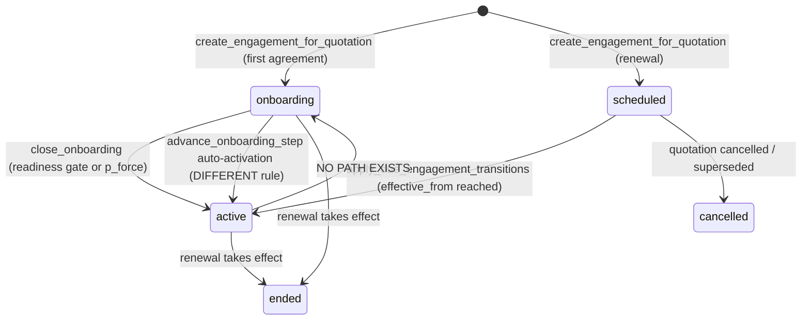
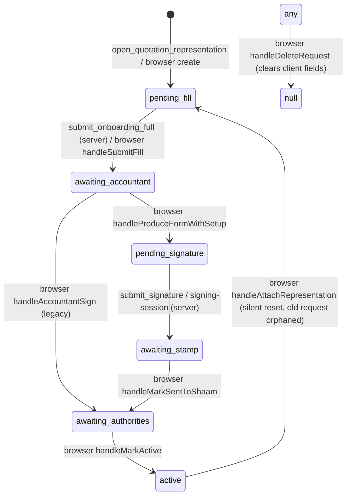

# State-consistency audit — client / intake / representation / requests

Date: 2026-09-04 · Repo: guyashar1-ctrl/Tax-Calculatore @ b496240 · Investigation only, no code changed.

Evidence sources: the working tree, the **deployed** function bodies pulled from the production database (`pg_get_functiondef`, project `uoweoqtuiettozagwgdw`), aggregate production data (ids and statuses only), and a live session in the production app (Chrome, logged in as Guy) with the Performance API.

---

## 1. Executive summary

**Is the reported contradiction real? Yes, and it is reproducible on production data today.**
Client `128d0b4b…` is `lifecycle_stage = active`, `representation_status = active`, its `representation` step is `completed`, and it has **no engagement row at all**. Opening the tax file → "שלח שאלון עדכון" renders the "עדכון סטטוס מס" dialog with **"נדרש לסגירת הקליטה" checked by default** (reproduced live, DOM text captured). Two requests created on this client this morning (09:05 and 09:07) are stored with `required_for_close = true`.

**Confirmed root cause.** "סגירת הקליטה" is a property of an *engagement* (`engagements.status: onboarding → active`), and an engagement is born **only** from an approved quotation (`create_engagement_for_quotation`). The request flag `required_for_close` is written unconditionally by `create_onboarding_request` (`coalesce(p_required_for_close, true)`) with no look at whether an engagement exists or is still open; the function even falls back to attaching the step to *any* engagement, including an `active` or `ended` one. The flag's only reader, `onboarding_close_readiness`, runs only while `engagements.status = 'onboarding'`. So for every client that is "active" by representation rather than by engagement, the flag is dead data that the UI still asks about.

**How systemic is it?** Very. The flag is a symptom of two lifecycles that were bolted together:

| Fact | Where it is | Production numbers (22 clients) |
|---|---|---|
| Client is "active" because representation finished | `clients.representation_status = 'active'` → `derive_lifecycle_stage` branch 5 | **11 clients**, none with an engagement |
| Client is "in intake" because of an engagement | `engagements.status = 'onboarding'` | **3 clients** (all also `representation_status = active`) |
| Client is "active" because intake was closed | `engagements.status = 'active'` | **0 — no engagement has ever been closed in production** |
| Steps with no engagement at all | `onboarding_steps.engagement_id is null` | **59 steps** |

Beyond the reported case, the audit found: two *different* server rules for "intake is complete" (`close_onboarding` vs the auto-activation inside `advance_onboarding_step`); representation status stored twice and transitioned from the **browser** with two non-atomic writes (one live client is `active` on the card while its request is `awaiting_accountant`); "represented" computed nine different ways in the frontend, including a `?? 'active'` default that makes "never represented" indistinguishable from "represented"; no server guard against re-opening representation on an active client; no path back from an active engagement to intake while every step can be reopened; and a `lifecycle_stage` that is stored, self-referential, and only refreshed by triggers on two of its four inputs.

**Answer to the A/B/C/D question.** The combination *Client = represented, Request = requires closing intake* is **D and C**: the label refers to a concept (engagement onboarding) the client does not have, and the model lets the flag be stored anyway. Whether a represented client can ever legitimately enter a *new* intake is a real product decision (§8, U1); today the code answers "no" by accident (renewals go `scheduled → active`, never through `onboarding`).

**Performance.** Not the internet. The app runs an unbounded request loop on every screen: a context provider recreates its value on each render, a `useCallback` depends on that object, and the effect it drives refetches immediately. Measured live: **~22 Supabase requests per second** sustained while a client card is open (108–116 requests per 5 s), up to **36 in flight**, and the `automation_workers` query (a `limit 1` read) degrading to **2.5–4.7 s average** under its own load. The "+ request" dialog itself costs two parallel ~120 ms reads. Page TTFB was 35 ms and static load 692 ms.

---

## 2. Current domain model (as the code actually behaves)

### 2.1 Client (`clients`)
- `lifecycle_stage` — **stored**, CHECK `lead|quoted|onboarding|active|archived`, default `lead`. Written by `refresh_lifecycle_stage_for` → `derive_lifecycle_stage` (deployed body in §12), by the browser only for archive/unarchive (`useClients.ts:119`), and by the nightly `refresh_lifecycle_stages`. The derive function reads its **own stored value** in two branches (`archived`, `onboarding → lead`), so the column is both input and output.
- `representation_status` — stored, **no CHECK constraint**, default `'active'` in the schema (`01-schema.sql:202`) but `null` for quote-born clients (`49-client-born-at-quote.sql:175`). Written by 5 SQL functions and by **7 browser code paths** in `App.tsx`.
- `representation_request_id`, `authority_representations` (per-authority registry with `status/level/targets`), `paperless_status`, `intake_token`, `portal_token`, plus tax-file attributes (`vat_status`, `withholding_status`) that are *not* representation.
- TypeScript: `Client.lifecycleStage`, `representationStatus: RepresentationStatus | null` with the comment "default 'active' for manually created clients" (`src/types/index.ts:702`).

### 2.2 Intake / Engagement (`engagements`)
- `status` CHECK `onboarding|active|ended|cancelled|scheduled`; `process_published_at`; `activated_at`; `effective_from`; `supersedes_engagement_id`. Partial unique index: one `onboarding|active` per client, one `scheduled` per client.
- Born **only** in `create_engagement_for_quotation` (first agreement → `onboarding`; renewal → `scheduled`, then `apply_due_engagement_transitions` moves it straight to `active` and re-parents open steps).
- Closed by `close_onboarding` (manual, gated by `onboarding_close_readiness`, `p_force` bypass) **or** silently by `advance_onboarding_step` when no open step remains (different rule, §5 C2).
- **There is no function anywhere that moves an engagement back to `onboarding`.**
- "Intake" (קליטה) in the UI = this object. The client-facing "intake questionnaire" (`intake_questionnaire` step, `reopen_intake`, `annual_report_sessions`) is a **different concept with the same Hebrew word**.

### 2.3 Representation (`representation_requests` + projections)
- `status` (no CHECK) with six conventional values: `pending_fill → awaiting_accountant → pending_signature → awaiting_stamp → awaiting_authorities → active`. `onboarding_status pending|submitted`. `scope`, `signers`, `execution` jsonb.
- Transitions: `pending_fill` and `awaiting_accountant`/`awaiting_stamp` are set by server functions (`open_quotation_representation`, `submit_onboarding_full`, `submit_signature`, the `signing-session` edge function). **`pending_signature`, `awaiting_authorities` and `active` are set only from the browser** (`App.tsx:1523–1601`): `updateRequest(...)` then `updateClient(...)` as two separate REST writes.
- Projections: trigger `sync_representation_step` (on status UPDATE) copies status → the `representation` onboarding step; `ensure_representation_step` (on INSERT / link) creates it with a **duplicated copy of the same map**; `sync_rep_task_ball` copies to tasks; `clients.representation_status` copied by hand; `build_client_portal` reads the request directly.
- No unique constraint on `(linked_client_id)`; `handleAttachRepresentation` overwrites an active client back to `pending_fill` with no check.

### 2.4 Requests (`onboarding_steps`)
- `status` CHECK of 10 values; `ball`; `required_for_close boolean not null default true`; `published_at` (null = draft); `draft_payload`; `pending_cancel`; `depends_on_step_id` + `onboarding_step_dependencies`; `engagement_id` **nullable**; `scope person|engagement`.
- Created by the generator (from the approved quotation), by triggers (`representation`, `rep_client_approval`, `representation_upgrade`, `paperless_tax_authority`), and by `create_onboarding_request` (catalog, free-form, templates, tax-file preset, document send).
- Status changes only via `advance_onboarding_step` (action → status map, not a state×action matrix) plus direct updates in `publish_case_changes`, `reopen_*`, and the sync triggers.

### 2.5 Relationships
```
quotation(approved) ──► engagement(onboarding) ──close──► engagement(active)
        │                        ▲
        └─► representation_request ──trigger──► step 'representation' ──adopt──┘ (only if engagement exists)
client.lifecycle_stage  ◄── derived from: engagement.status, clients.representation_status, quotation.status, self
client.representation_status ◄── hand-copied from representation_request.status (browser + SQL)
step.required_for_close ──read by──► onboarding_close_readiness(engagement)  [only while engagement.status='onboarding']
```
Requests belong to the **client**; intake belongs to the **engagement**; the flag on the request talks about the engagement. That mismatch is the bug class.

---

## 3. State-transition map

### 3.1 Engagement (intake)

- **Valid:** everything above except the last line.
- **Questionable:** `onboarding → active` via auto-activation ignores `required_for_close` and uses a 2-type exclusion list instead of the readiness gate's 8-type list; it also skips the "onboarding_closed" notification and does not call `refresh_lifecycle_stage_for` directly (the engagements trigger does it).
- **Unenforced:** creating requests, flipping `required_for_close`, publishing, and reopening steps are all allowed regardless of engagement status. No function guards on `engagements.status` except `close_onboarding` (noop when not `onboarding`) and `publish_case_changes` step 1.

### 3.2 Representation request

- **Owner:** mixed. Server owns client-side submissions; the **browser owns every accountant-side transition** through plain table updates permitted by RLS (`reps_update_own`), with no allowed-transition check anywhere.
- **Unenforced:** any status string is accepted (no CHECK); `active → pending_fill`; a second request for the same client; the client row and request row diverging.

### 3.3 Client lifecycle (derived)
Order of `derive_lifecycle_stage` (deployed): archived → engagement `onboarding` → engagement `active|ended` → representation pending → representation `active` → approved quotation → sent/viewed quotation → lead. Refreshed by triggers on `engagements` and `quotations` **only**; changes to `representation_requests` or `clients.representation_status` do **not** trigger a refresh (the browser calls `refresh_lifecycle_stage_for` by hand in five places; otherwise 05:15 cron).

### 3.4 Request (step)
`advance_onboarding_step` maps action → status with no regard to current status except the `locked` gate: `reopen` from any terminal state, `cancel` from anything, `complete` from `locked` if dependencies met. `set_onboarding_step_required` refuses only `completed|verified|cancelled`. `update_onboarding_request` never touches `required_for_close`. Revive-on-re-add (`create_onboarding_request`) rewrites a cancelled row in place, including its flag and `published_at`.

---

## 4. Source-of-truth map

| Business fact | Authoritative today | Copies / re-derivations | Risk |
|---|---|---|---|
| Client is in intake / active | `clients.lifecycle_stage` (stored) | `derive_lifecycle_stage` (server), `onboardingCount` from engagements (`ClientList.tsx:242`), `summarizeClientOnboarding(steps)` (`ClientsOnboardingSection.tsx:83`), `hasOnboarding` from steps/engagements (`ClientWorkspace.tsx:457`), `awaitingQuoteApproval` re-implemented in TS (`OnboardingTab.tsx:786`, `ClientWorkspace.tsx:1005`) | **High** — stored value refreshed by triggers on only 2 of 4 inputs; four Hebrew wordings for the same stages |
| Intake is closed | `engagements.status` | none in UI beyond `activeEngagement?.status === 'onboarding'`; two `activeEngagement` filters (`ClientWorkspace.tsx:558` vs `OnboardingTab.tsx:379`) | **High** — two server close rules; no reopen |
| Request blocks intake close | `onboarding_steps.required_for_close` | `isStepRequiredForClose` mirror (`types/onboarding.ts:813`), three different default/exclusion lists (server readiness: 8 types; `set_onboarding_step_required`: 2 types; TS `DEFAULT_OPTIONAL_STEP_TYPES`: 3 types) | **High** — flag stored for clients that have no intake |
| Representation status | `representation_requests.status` (declared truth, `31-onboarding-engine.sql:458`) | `clients.representation_status` (hand-copied), `representation` step (trigger), tasks ball (trigger), portal reads request directly, `authority_representations[*].status` (set wholesale by `handleMarkActive`), `taxFiles[*].repStatus` | **Critical** — browser dual-write; one live client already diverged |
| "Is this client represented?" | none | 9 predicates (`request.status==='active'`, `client.representationStatus ?? 'active'`, `!!representationStatus`, every-authority-active, per-person resolver, tax-file existence, NI 6-source cascade, Hebrew-label string compare `nextActionForClient.ts:62`) | **Critical** |
| Request visible to client | `onboarding_steps.published_at` | `payload.published` (legacy), `engagement.process_published_at` (process-level), hold flag `payload.heldUntilApproval` | Medium — two entry points publish differently (§5 C16) |
| Step dependency | `onboarding_step_dependencies` | `depends_on_step_id` (legacy, trigger-mirrored); `InlineComposer` sends `deps[0]` then the rest in a second RPC | Low |
| Firm settings for the dialog | `profiles.settings` | refetched on every dialog open although `useFirmProfile` holds it | Low (perf) |

---

## 5. Contradictions found

Severity: **S1** wrong business state visible/stored · **S2** rule enforced in only one of several places · **S3** misleading but currently harmless.

**C1 · Request "required to close intake" on a client with no intake (the reported bug) — S1.**
Scenario: any catalog/preset/free-form request on a client whose `lifecycle_stage='active'` came from representation. Why contradictory: nothing can ever consume the flag; the UI phrases it as a promise ("לא יחסום את הסגירה"). Path: `TaxFileTab.tsx:1431` → `ClientWorkspace.tsx:836,1000` → `AddRequestDialog.tsx:188,476,1098` → `create_onboarding_request` (no engagement guard; `v_eng` fallback). Data: prod clients `128d0b4b`, `66fb2f79` have open steps with `required_for_close=true` and `engagement_id=null`. Invariant: `required_for_close` is defined only when `engagement_id` refers to an engagement in `onboarding`; otherwise it is null and the control is absent.

**C2 · Two independent "intake complete" rules — S2.**
`close_onboarding` uses `onboarding_close_readiness` (open ∧ required ∧ not in 8 hidden types ∧ release-letter window). `advance_onboarding_step` (deployed) auto-activates when no open step remains except `representation_upgrade|first_month_review`, **ignoring `required_for_close`**. Consequences: an optional request still blocks auto-activation; a hidden `kyc_identification` step (client `128d` has one pending) blocks auto-activation but not manual close; auto-activation skips the `onboarding_closed` notification. Invariant: exactly one predicate `intake_ready(engagement)`; every activation path calls it.

**C3 · Client says "represented", request says "waiting for accountant" — S1 (live).**
Client `66fb2f79`: `clients.representation_status='active'`, latest request `awaiting_accountant` (updated 2026-07-15), `representation` step `in_progress`, lifecycle `active`. Cause: two browser writes (`updateRequest`, `updateClient`) with no transaction and no server transition function; whichever fails or is reordered leaves the pair inconsistent. The card badge reads "מיוצג פעיל" while the execution center offers "produce the form". Invariant: `clients.representation_status` is derived (view or trigger) from the request, never written by a client.

**C4 · "Active client" whose representation step is open — S1.** Same client: header/badge/stage all "active", journey shows "ייצוג מול הרשויות · בטיפול". Same root as C3.

**C5 · `null` representation = "represented" in some screens, "never represented" in others — S2.**
`ClientList.tsx:223` and `ClientWorkspace.tsx:608` default `?? 'active'`; `ClientWorkspace.tsx:614`, `journeyPresentation.ts:252`, `niPersons.ts:232` treat null as "no representation". 7 of 22 production clients are `active` with `representation_status='active'` but **no request row** (manual/legacy). Invariant: the domain needs an explicit `not_represented` (or `unknown`) value; `null` must not mean two things.

**C6 · Representation can be re-opened on an active client silently — S1.**
`handleAttachRepresentation` (`App.tsx:1320`) overwrites `representationStatus='pending_fill'`, `representationRequestId`, `authorityRepresentations` without reading current values; old request stays `active` and orphaned; `ensure_representation_step` tracks the newest while `sync_representation_step` updates all. No unique index on `(linked_client_id)` for open requests. Invariant: at most one non-terminal representation request per client; starting a new one from `active` is an explicit, logged action (or forbidden — see U1).

**C7 · Intake closed, but steps can be reopened and stay "required" — S2.**
`reopen_institution_alignment`, `reopen_paperless_registration`, `advance_onboarding_step('reopen')` have no engagement guard; no function returns an engagement to `onboarding`; `apply_due_engagement_transitions` moves open steps onto a new engagement that is immediately `active`. Result: "הקליטה נסגרה" + required, open, published steps. Invariant: either reopening a required step reopens the intake, or a closed intake makes the flag inert **and invisible** (consistent with C1's invariant).

**C8 · Ended engagement ⇒ "active client" — S3/product.** `derive_lifecycle_stage` branch 3 maps `status in ('active','ended')` to `active`. A client whose only agreement ended is still "לקוח פעיל". See U4.

**C9 · `lifecycle_stage` goes stale by design — S2.** No trigger on `representation_requests` or on `clients.representation_status`; the browser must remember to call `refresh_lifecycle_stage_for` (it does in 5 places, e.g. `App.tsx:1104`, and forgets in the SQL paths of migrations 23/110/113/148 that set `awaiting_accountant`). Today 0 mismatches, only because the cron ran. Invariant: every writer of an input refreshes the derived value, or the value is a view.

**C10 · "Process published" computed with two different engagement filters — S2.** `ClientWorkspace.tsx:558` excludes only `cancelled`; `OnboardingTab.tsx:379` excludes `ended|scheduled|cancelled`. A client with an ended and a scheduled engagement gets a different `processPublished` (and therefore a different `p_published`) depending on which entry point opened the dialog. Invariant: one selector (`currentEngagement` in `engagementSelectors.ts` already exists and is used by billing only).

**C11 · Three lists of "steps that don't block" — S2.** Server readiness excludes 8 types; `set_onboarding_step_required` defaults by 2 types; TS `DEFAULT_OPTIONAL_STEP_TYPES` has 3 and `LEGACY_AUTO_OFFICE_TYPES` mirrors the 8. The TS file itself says "any change here must be made there too". Invariant: the frontend receives `blocking[]` from the server (readiness RPC already returns it) and never computes it.

**C12 · Cancelled request is "revived" with a new identity of rules — S3.** `create_onboarding_request` reuses a cancelled row, resets `required_for_close`, `published_at`, `completed_*`, and deletes its dependency edges; history of the earlier cancellation lives only in events. Client `128d` shows `intake_questionnaire` cancelled → the dialog offers to create it again as required. Acceptable if intended; document it.

**C13 · Nine ways to compute "represented" — S2.** Listed in §4. The worst is `nextActionForClient.ts:62` comparing against the Hebrew label `'מיוצג פעיל'`.

**C14 · Status columns without constraints, writable from the browser — S2.** `representation_requests.status` and `clients.representation_status` have no CHECK; RLS `reps_update_own`/`clients_update_own` allow any value. `representationAction(status)` is a total lookup that returns `undefined` on an unknown string.

**C15 · Two surfaces read representation differently — S2.** Office reads the `representation` step (projection); the client portal (`build_client_portal`, `75-portal-representation-standalone.sql:81`) reads the newest request row directly. With C6 duplicates they can disagree.

**C16 · Two request entry points, two publication semantics — S2.** `AddRequestDialog` sends `p_published = processPublished ? sendNow : true` — for a client with no engagement (`processPublished=false`) every catalog request is **published to the client immediately with no draft option** (the checkbox is hidden). `InlineComposer` always creates drafts (`p_published:false`) that require "עדכן את דף הלקוח". Same client, same request type, opposite defaults. Invariant: publication default is a function of the client's state, computed once.

**C17 · Dependency picker offers completed steps — S3.** `dependencyOptions = steps.filter(s => s.status !== 'cancelled')` (`AddRequestDialog.tsx:443`); the live dialog listed the completed "ייצוג מול הרשויות" under "ייפתח רק אחרי". Harmless (server treats satisfied deps as met) but reads as a lie.

---

## 6. Original bug deep dive

**Exact path.**
1. `TaxFileTab.tsx:1431–1436` — button "שלח שאלון עדכון" / "שלח שוב", shown unconditionally on the tax file (the default landing tab for `active|archived` clients, `ClientWorkspace.tsx:600`).
2. `ClientWorkspace.tsx:836` → `setIntakeModalOpen(true)`; `:1000–1011` mounts `AddRequestDialog` with `presetType="intake_questionnaire"`, `steps={clientSteps}`, `processPublished={!!activeEngagement?.processPublishedAt}`, `awaitingQuoteApproval={lifecycleStage in (quoted, lead)}`.
3. `AddRequestDialog.tsx:188` — `requiredForClose` state initialised to `true` (only document-send presets start `false`). `:1013` renders `<Shared>` because `existing` (non-cancelled step types) does not contain `intake_questionnaire` (the client's earlier one is `cancelled`). `:1098–1104` — the checkbox, unconditional inside `Shared`.
4. `:1026–1031` → `create(presetType, {})` → `rpcCreate` `:462–484` → `supabase.rpc('create_onboarding_request', { …, p_published: processPublished ? sendNow : true, p_required_for_close: requiredForClose })`.
5. Deployed `create_onboarding_request`: owner check → step-type allow-list → duplicate check → `v_eng` := newest `onboarding` engagement, **else newest engagement of any status, else null** → 135 hold only if `derive_lifecycle_stage in (lead, quoted)` → revive cancelled row **or** insert with `required_for_close = coalesce(p_required_for_close, true)`, `published_at = now()`.

**Data it uses:** the client's steps (existence/dependencies), `engagement.process_published_at` (send-now default), `lifecycle_stage` (hold). **Data it ignores:** whether an engagement exists, its status, `activated_at`, `representation_status`, and that the client is `active`. **Why represented clients reach it:** they are `active` through `representation_status`, not through an engagement; the journey/requests tab is always visible (`JOURNEY_TABS` fixed, `JourneyTab.tsx:87` "requests show for old clients with no engagement"); the tax-file button has no condition; `Shared` has no condition; the server has no guard. The same checkbox exists in `InlineComposer.tsx:627` (behind "עוד הגדרות", new requests only) with the same absence of context.

**Note on the label:** "סגירת הקליטה" here is engagement onboarding. The button that opened the dialog is about the *tax-status questionnaire*, which the code also calls "intake" (`intake_questionnaire`, `reopen_intake`). Two concepts, one word — part of why the checkbox feels plausible in that dialog.

---

## 7. Performance findings

**Evidence (production, Chrome, Guy's session, Performance API).**

| Measurement | Value |
|---|---|
| Navigation TTFB / DOMContentLoaded / load | 35 ms / 490 ms / 692 ms |
| Supabase requests during first 13 s on `#/clients` | **245** (117 `automation_jobs`, 108 `automation_workers`, 20 real data reads) |
| Supabase requests during first 25 s on a client card | **542** (267 `automation_jobs`, 268 `automation_workers`); max **36 concurrent** |
| Sustained rate at rest (tax-file tab / requests tab) | **108 / 116 requests per 5 s** |
| `automation_workers` (`select * … limit 1`) latency | avg **1.3 s** on the list page → **2.5 s** → **4.7 s** on the card (queueing behind itself) |
| Ordinary reads (`clients`, `engagements`, `onboarding_steps`, `profiles`) | 100–300 ms each |
| `representation_requests` `select *` | **1.7 s** (jsonb payloads: signatures, signature values) |
| DOM mutations at rest | 792 in 3 s (constant re-render) |
| Long tasks > 50 ms | 0 |
| "+ request" dialog own cost | `profiles` 124 ms + `journey_templates` 109 ms, in parallel |

**Bottleneck (confirmed by code).** `shaamReadiness.tsx:205` passes a new object literal as the context value on every render; `useAuthorityConnections.ts:81–98` puts that object in a `useCallback` dependency list; the effect at `:100–105` calls `refresh()` immediately whenever `refresh` changes; `refresh()` fetches `automation_jobs` then `await readiness.refresh()` (`:97`) which `setStatus(…)` with a fresh object (`shaamReadiness.tsx:143`) → provider re-renders → new context value → new `refresh` → effect again. Network latency is the only throttle. `AuthorityConnectionButtons` is mounted in the app header (`App.tsx:2199`) so the loop runs on every screen, and every iteration re-renders the whole tree under the provider.

**Does the internet explain it?** No. TTFB and single-query latency are normal; the slow queries are slow because the app is issuing ~20 per second to the same table.

**Split.** Network latency: normal (~100 ms/query). Backend latency: inflated by self-inflicted load on `automation_workers`/`automation_jobs`; `representation_requests` is genuinely heavy (1.7 s). Frontend/rendering: continuous re-render of the app tree (~260 DOM mutations/s at rest) and stale accessibility refs (clicks on tab buttons were lost twice during the session; screenshots timed out with "renderer may be frozen"). Unnecessary work: everything below.

**Application-side improvements available (not implemented).**
1. Memoize the readiness context value; depend on `readiness.refresh` (already stable) instead of the object. One-line class of fix; removes ~95 % of traffic.
2. `useOnboarding` is called office-wide (`App.tsx:446`) and every mutation triggers a full refresh (2 serial round trips: engagements+steps, then events limited to 200) — `OnboardingTab.tsx` has ~15 `refresh?.()` sites; `InlineComposer` already returns an optimistic step.
3. `onboarding_step_dependencies` refetched on every `steps` identity change (`OnboardingTab.tsx:686`), i.e. every 20 s pulse.
4. `email_messages` fetched twice, unfiltered, 200 rows (`JourneyTab.tsx:94`, `OnboardingTab.tsx:3880`); `documents` fetched up to 3× per card; `profiles` refetched on every dialog open.
5. `representation_requests` `select *` on app start: 1.7 s; select columns or move jsonb blobs out.
6. Serial loops: paperless sequence (3 RPCs), file persist (upload+upsert per file), `expireStale` quotations, `reopen_institution_alignment` per step.
7. No code splitting: `pdf-lib` in the main chunk, `pdfjs-dist` in the workspace chunk.

---

## 8. Product unknowns (decisions only a human can make)

**U1 · Can a represented, active client ever enter a new intake?**
Scenario: an old client (representation done years ago, no engagement) signs a first monthly agreement, or an active client renews with new services (paperless, retainer).
A. **No.** Intake happens once; later agreements add requests to a permanent "open items" list with no "close" concept. Consequence: drop `required_for_close` from every non-onboarding context; renewals stay `scheduled → active`.
B. **Yes, explicitly.** A new engagement may start in `onboarding` (a "setup phase") even for an active client, with its own required steps and close. Consequence: `derive_lifecycle_stage` must stop mapping "has an onboarding engagement" to "בקליטה" for an already-active client (needs a sub-state), and requests must carry an engagement.
Recommendation: **A** for now. Nothing in the data or the UI needs B; B reintroduces the exact ambiguity that migration 118 chose `scheduled` to avoid.

**U2 · What does "required" mean outside an intake?**
Scenario: Guy adds "bring 106 forms" to an active client and wants it to count as blocking *something* (a monthly close? the annual report?).
A. The control disappears when there is no open intake (flag null). B. Replace with a client-level "must-do before X" concept later.
Recommendation: **A** now; B is a separate feature, not a fix.

**U3 · Which object is the truth for representation status?**
A. The request; `clients.representation_status` becomes derived and read-only. B. The client; the request becomes a document. Recommendation: **A** (the code already declares it at `31-onboarding-engine.sql:458`; three of five migrations follow it).

**U4 · A client whose only agreement ended.** A. Stays "active" (today). B. New stage "former"/moves to archive automatically. Recommendation: B is more honest, but it changes lists Guy uses daily; decide with him.

**U5 · Manual close vs automatic close.** A. Keep both, unify the rule. B. Remove auto-activation and require the explicit "סגור קליטה" (readiness already shows what blocks). Recommendation: **B**; closing intake also sends a notification and should be a deliberate act.

**U6 · Legacy clients with `representation_status='active'` and no request (7 in prod).** A. Treat as represented (grandfathered). B. Reset to `unknown` and ask. Recommendation: A, but stop writing the schema default `'active'` for new rows.

---

## 9. Recommended target model (smallest robust)

1. **Intake is an engagement property; requests reference it explicitly.** `required_for_close` becomes nullable and is set **by the server** only when the step is attached to an engagement whose status is `onboarding`; the RPC ignores the argument otherwise and returns `intakeOpen:false`. UI shows the control only when the server says the intake is open. No new tables.
2. **One close predicate.** `onboarding_close_readiness(engagement)` is the only rule; `advance_onboarding_step` either calls it or stops activating (U5). The frontend deletes `isStepRequiredForClose/isStepSatisfiedForClose/blockingStepsForClose` and uses the RPC's `blocking[]`.
3. **Representation transitions move to the server.** One function `transition_representation(request_id, action)` with an allowed-transition table (`awaiting_stamp → awaiting_authorities`, `awaiting_authorities → active`, …) that writes the request, the client column, the step, and calls `refresh_lifecycle_stage_for` in one transaction. Browser code in `App.tsx:1510–1601` becomes six RPC calls. Add CHECK constraints on both status columns and a partial unique index: one non-`active` request per client.
4. **Derived facts have triggers on all their inputs.** Add `refresh_lifecycle_stage_for` triggers on `representation_requests(status)` and `clients(representation_status)`. Keep the stored column (it is indexed and filtered everywhere).
5. **One selector module** `src/lib/clientState.ts`: `currentEngagement(client)`, `intakeOpen(client)`, `representationState(client)` (`not_represented | in_process | active` from the request row), `canStartRepresentation`, `canAddRequest`, `requestDefaults(client)` (published/required). Every screen imports these; the nine predicates and the two `activeEngagement` filters go away. This is "allowedActions" without a framework.
6. **Vocabulary.** Rename in code (not in Hebrew UI) the questionnaire concept away from "intake" (`intake_questionnaire` stays as a DB value, but the TS/UI helpers say `taxStatusQuestionnaire`), so "close intake" has one meaning.

Not recommended: a generic state-machine library, event sourcing, or moving lifecycle derivation to a view (the column is used in list filters and indexes).

---

## 10. Proposed implementation plan (do not implement yet)

| # | Change | Scope | Notes |
|---|---|---|---|
| P0 | Fix the readiness/connections request loop | `shaamReadiness.tsx:205`, `useAuthorityConnections.ts:98` | Separate PR; verify with the same Performance-API probe (target: < 1 req/s at rest) |
| P1 | Server: `create_onboarding_request` sets `required_for_close` only for an `onboarding` engagement, returns `intakeOpen`; `set_onboarding_step_required` refuses when no open intake; backfill null on steps whose engagement is not `onboarding` or is null | migration | Resolves C1, C7; requires U1=A, U2=A |
| P2 | UI: `Shared` and `InlineComposer` render the control from `intakeOpen`; tax-file button and `AddRequestDialog` use one `requestDefaults(client)` | 3 files | Resolves C16, C17 (filter satisfied steps out of the dependency picker) |
| P3 | Representation transitions as one server function + CHECK constraints + partial unique index; `App.tsx` handlers call it; repair client `66fb2f79` by re-deriving from its request | migration + `App.tsx` | Resolves C3, C4, C6, C14, C15 |
| P4 | Unify close rule (U5) | migration | Resolves C2, C11 |
| P5 | Lifecycle triggers on representation inputs; decide U4/U6; stop schema default `'active'` | migration | Resolves C9, C5 (with an explicit `not_represented`) |
| P6 | `src/lib/clientState.ts` selectors; delete TS mirrors; single `currentEngagement` | frontend | Resolves C10, C13 |
| P7 | Perf hygiene: scoped refresh after mutations, dependency refetch keyed on ids, dedupe `email_messages`/`documents`/`profiles`, column-select `representation_requests`, lazy-load PDF libs | frontend | Measure before/after |

---

## 11. Tests and invariants to establish

Database-level (SQL tests or `scripts/staging-test-*.mjs`):
1. `create_onboarding_request` on a client with no engagement → `required_for_close is null`, response `intakeOpen=false`; with an `active` engagement → same; with an `onboarding` engagement → honours the argument.
2. `set_onboarding_step_required` on a step whose engagement is not `onboarding` → error `no_open_intake`.
3. After `close_onboarding`, no step of that engagement is `required_for_close=true` and open; reopening a step does not resurrect the flag.
4. `advance_onboarding_step` never changes `engagements.status` unless `onboarding_close_readiness.ready` (or never, per U5).
5. Representation: every transition outside the allowed table is rejected; `clients.representation_status = request.status` after each transition (assert in the same test); `refresh_lifecycle_stage_for` result equals stored `lifecycle_stage` immediately after.
6. Inserting a second non-terminal representation request for a client fails on the unique index.
7. `derive_lifecycle_stage` fixtures: (no engagement, rep active) → active; (onboarding engagement, rep active) → onboarding; (ended engagement only) → per U4; (rep pending, no engagement) → onboarding; (lead with no signals) → lead.
8. Consistency sweep query (run nightly, alert on > 0): steps with `required_for_close` and no open intake; clients whose `representation_status` ≠ latest request status; `lifecycle_stage` ≠ derived; clients with > 1 open representation request.

Frontend (harness screens already exist: `__TestAddRequestDialog`, `__TestOnboarding`):
9. Dialog with `intakeOpen=false` shows no "נדרש לסגירת הקליטה"; with `intakeOpen=true` shows it checked by default; document-send preset unchecked.
10. `requestDefaults` for a client without an engagement never publishes silently unless the user chose it (or the product says catalog requests always publish — then both entry points do).
11. `representationState()` returns `not_represented` for `null`, `in_process` for the five pending values, `active` only for `active`; no screen defaults `null` to `active` (lint rule or grep test for `?? 'active'`).
12. Performance guard: a test that mounts the app shell and asserts fewer than N Supabase calls in 10 s with no interaction.

---

## 12. Evidence index

Deployed function bodies (pulled 2026-09-04): `create_onboarding_request`, `onboarding_close_readiness`, `close_onboarding`, `derive_lifecycle_stage`, `set_onboarding_step_required`, `advance_onboarding_step`, `publish_case_changes`, `publish_onboarding_process`, `create_engagement_for_quotation`, `apply_due_engagement_transitions`, `current_engagement_id`, `sync_representation_step`, `ensure_representation_step`, `ensure_rep_client_approval_step`, `sync_representation_upgrade_step`, `reopen_paperless_registration`, `open_quotation_representation`, `update_onboarding_request`, `tg_touch_lifecycle_stage`, `refresh_lifecycle_stage_for`, `adopt_*_to_engagement`. Triggers, CHECK constraints and RLS policies on `clients`, `engagements`, `onboarding_steps`, `representation_requests`, `quotations` (queried from `pg_trigger`, `pg_constraint`, `pg_policies`).

Repo files: `src/components/clientTabs/AddRequestDialog.tsx` (188, 430–443, 462–484, 1013, 1098–1122), `InlineComposer.tsx` (135, 258–353, 627–633), `ClientWorkspace.tsx` (326–332, 457–465, 558–560, 599–614, 836, 1000–1011), `clientTabs/OnboardingTab.tsx` (379–382, 443–467, 678–686, 786–787, 928–939, 1069–1077, 1496–1549, 2032–2041, 4092), `clientTabs/TaxFileTab.tsx` (320–322, 1431–1436), `clientTabs/JourneyTab.tsx` (87–94), `ClientList.tsx` (89–104, 223–245), `App.tsx` (446, 476–485, 1104, 1250–1601, 2199), `src/types/onboarding.ts` (11–40, 158–173, 682–721, 769–853), `src/types/index.ts` (694–709, 844–851, 1234–1260), `src/utils/{clientDerived,nextActionForClient,engagementSelectors,onboardingNext,journeyPresentation,personRepresentation,niPersons,representationAction,repSigners,repScope}.ts`, `src/hooks/{useOnboarding,useClients,useRepresentationRequests,shaamReadiness,useAuthorityConnections,useAutomationJobs,useLivePulse,useEmailMessages}.ts(x)`, `src/lib/dbMappers.ts` (56–60, 258–265).

Migrations: `01-schema.sql` (202–203, 386, 415), `30-engagements.sql`, `31-onboarding-engine.sql` (458–497), `46-*`, `49-client-born-at-quote.sql` (13–108, 175), `62-*` (48–56 unique indexes), `68-onboarding-required-for-close.sql`, `70-*`, `71-set-step-required.sql`, `75-portal-representation-standalone.sql` (81–108), `77-*`, `87-derive-lifecycle-stage-onboarding-fallback.sql`, `92-*` (197–227), `100-revive-cancelled-request.sql` (34–204), `101-*`, `102-representation-lifecycle.sql`, `105-close-gate-ignores-hidden-office-steps.sql`, `109-representation-step-always.sql`, `110-*` (223–445), `114-*` (739–788), `118-commercial-lifecycle.sql` (40–152, 159–388), `131-rep-client-approval.sql`, `135-requests-held-until-quote-approval.sql`, `148-*`, `149-*`. Migrations 33–43 and 52–55 are absent from the repo; `staging/schema-from-prod.sql` carries a pre-87 `derive_lifecycle_stage`.

Production data (aggregate, ids only): 22 clients; lifecycle × engagement × representation cross-tab; 3 engagements total, all `onboarding`, all published, none activated; 59 steps without engagement; clients `128d0b4b…` and `66fb2f79…` as described in §1/§5.

Live app probe: `https://crm.yasharcpa.co.il`, `#/clients` and `#/client/128d0b4b…`, `performance.getEntriesByType('resource')` aggregates, `MutationObserver` sample, `PerformanceObserver('longtask')`, dialog DOM text after clicking "שלח שאלון עדכון" (dialog closed afterwards; nothing was submitted).
